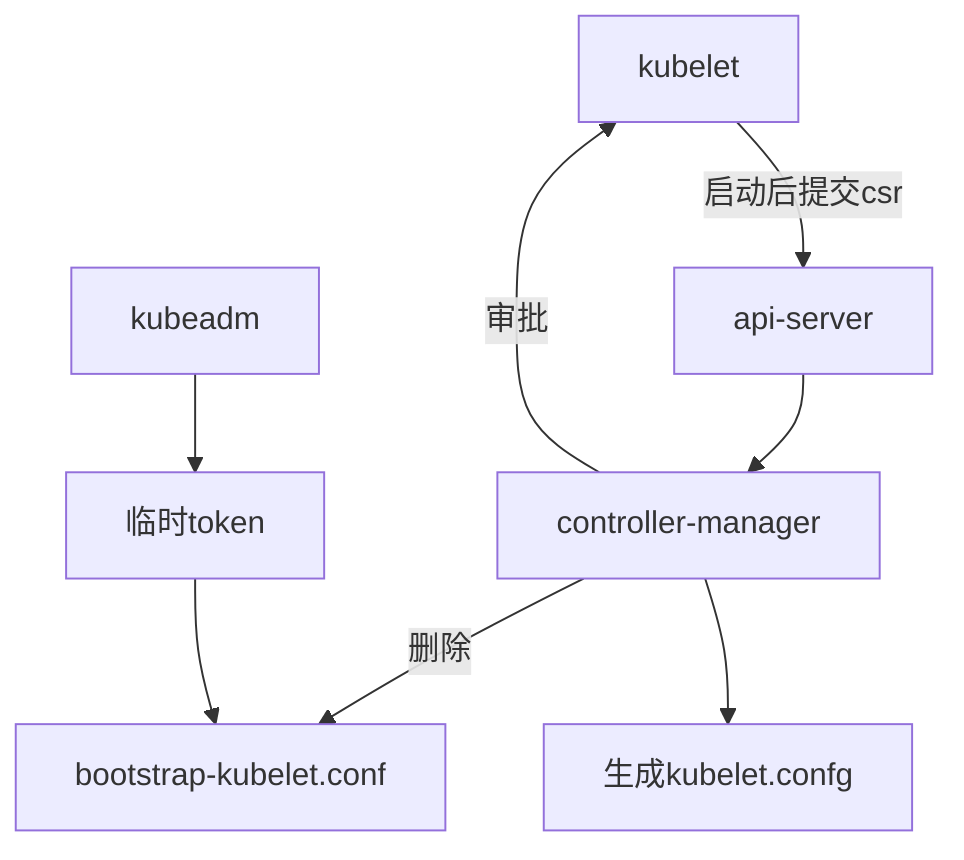
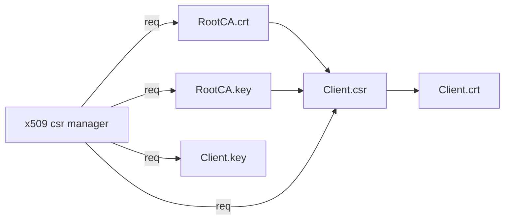

# k8s-证书机制

## 前言

问题目标：

1. k8s各组件分别使用了哪些证书；
2. 这些证书的用途是什么？
3. 这些证书分别由哪个CA签发；
4. 哪些组件证书会自动轮转？影响是什么？
5. 哪些证书需要手动轮转？影响是什么？

前提明确：

- 证书的作用
    - 保证加密密钥的安全传递、信息防篡改、身份认证
- k8s的认证方式有 Bootstrap、BasicAuth，该主要针对 TLS
    - k8s 集群内采用 双向TLS认证
- 依据 mtls 的通信方式将证书分类
    - 服务端证书 server cert
    - 客户端证书 client cert
    - 对等证书 peer cert

Kubernetes 需要 PKI 证书才能进行基于 TLS 的身份验证。若使用[kubeadm](https://kubernetes.io/zh/docs/reference/setup-tools/kubeadm/kubeadm/)安装的 Kubernetes， 则会自动生成集群所需的证书。但是如果是通过二进制搭建，所有的证书是需要自己生成的，下文所说的是集群必须的证书。

- 单向 TLS 认证：只需要服务器端提供证书，客户端通过服务器端证书验证服务的身份，但服务器并不验证客户端的身份。这种情况一般适用于对 Internet 开放的服务，例如搜索引擎网站，任何客户端都可以连接到服务器上进行访问，但客户端需要验证服务器的身份，以避免连接到伪造的恶意服务器。
- 双向 TLS 认证：除了客户端需要验证服务器的证书，服务器也要通过客户端证书验证客户端的身份。这种情况下服务器提供的是敏感信息，只允许特定身份的客户端访问。开启服务端验证客户端默认是关闭的，需要在服务端开启认证配置。

k8s 采用的是双向认证的方式。

## 前置知识

### pem证书与相关命令

Q：PEM 是什么？

PEM：Privacy Enhanced Mail的缩写，以文本的方式进行存储。以pem格式存储的证书结构

```bash
-----BEGIN CERTIFICATE-----
Base64编码过的证书数据
-----END CERTIFICATE-----
```

kubernetes使用的是.crt和.key后缀类型的证书和密钥。在生成证书的过程中，可以用cfssl生成.pem证书，然后直接命名为.crt。

### 证书查看命令

```bash
openssl x509 -in xxx.crt -text -noout
csfssl certinfo -cert xxx.crt
```

kubernetes 证书采用 X509 数字证书标准，使用kubeadm部署集群的话，可以自动生成证书，但证书有效期只有一年。推荐使用kubeadm生成证书用于参考，然后按照kubernetes的证书标准自制证书。

### kubeadm

生成证书命令：

```bash
kubeadm init phase certs all --cert-dir=绝对路径
```

以下为采用 kubeadm 生成 k8s 集群后所生成的证书和文件。

```bash
# /etc/kubernetes/
|-- admin.conf
|-- controller-manager.conf
|-- kubelet.conf
|-- scheduler.conf
|-- manifests
|-- pki
|   |-- apiserver.crt
|   |-- apiserver-etcd-client.crt
|   |-- apiserver-etcd-client.key
|   |-- apiserver.key
|   |-- apiserver-kubelet-client.crt
|   |-- apiserver-kubelet-client.key
|   |-- ca.crt
|   |-- ca.key
|   |-- etcd
|   |   |-- ca.crt
|   |   |-- ca.key
|   |   |-- healthcheck-client.crt
|   |   |-- healthcheck-client.key
|   |   |-- peer.crt
|   |   |-- peer.key
|   |   |-- server.crt
|   |   |-- server.key
|   |-- front-proxy-ca.crt
|   |-- front-proxy-ca.key
|   |-- front-proxy-client.crt
|   |-- front-proxy-client.key
|   |-- sa.key
|   |-- sa.pub

```

kubeadm主要是生成了etcd和kubernetes本身的证书。使用kubeadm安装集群的过程中，如果我们按照kubernetes标准自制证书，且跳过`kubeadm init phase certs`步骤，是不是所有场景都会使用到自制证书了呢？

答案是否定的，至少/etc/kubernetes/admin.conf、kubelet.conf、controller-manager.conf、scheduler.conf里面仍会默认生成认证证书和密钥。这些配置主要与user accounts有关，因此我们还要针对这些场景，自制证书，同时对上述文件进行扩展，这是后话。

下面对根证书和证书的内容进行抽象说明，主要参考[SSL 数字证书的标准、编码以及文件扩展名](https://kangzubin.com/certificate-format/)。

### 证书主要内容

**根证书主要内容：**

使用`openssl x509 -in xxx.crt -text -noout`查看。

```bash
Certificate:
    Data:
        Version: 3 (0x2)
        Serial Number: 0 (0x0)	说明：CA机构给该证书的唯一序列号，根证书为0
    Signature Algorithm: sha256WithRSAEncryption	说明：签名算法为SHA-256
        Issuer: CN=xxx	说明：证书颁发者的相关信息
        Validity	说明：证书生效日期和失效日期
            Not Before: xxx
            Not After : xxx
        Subject: CN=xxx	说明：证书持有者的相关信息
        Subject Public Key Info:	说明：服务端公开的密钥
            Public Key Algorithm: rsaEncryption	说明：RSA公钥
                Public-Key: (2048 bit)
                Modulus:
                    xx:xx:xx:xx:xx:xx:xx:xx:xx:xx:xx:xx:xx:xx:xx:
                Exponent: 65537 (0x10001)
        X509v3 extensions:
            X509v3 Key Usage: critical
                xxx, xxx, xxx
            X509v3 Basic Constraints: critical
                CA:TRUE
    Signature Algorithm: sha256WithRSAEncryption	说明：数字签名
         xx:xx:xx:xx:xx:xx:xx:xx:xx:xx:xx:xx:xx:xx:xx:xx:xx:xx:
```

**证书主要内容：**

```bash
Certificate:
    Data:
        Version: 3 (0x2)
        Serial Number: 12345678901234567890 (0x1234567890abcdef)	说明：CA机构给该证书的唯一序列号
    Signature Algorithm: sha256WithRSAEncryption	说明：签名算法为SHA-256
        Issuer: CN=xxx	说明：证书颁发者的相关信息
        Validity	说明：证书生效日期和失效日期
            Not Before: xxx
            Not After : xxx
        Subject: CN=xxx	说明：证书持有者的相关信息
        Subject Public Key Info:	说明：服务端公开的密钥
            Public Key Algorithm: rsaEncryption	说明：RSA公钥
                Public-Key: (2048 bit)
                Modulus:
                    xx:xx:xx:xx:xx:xx:xx:xx:xx:xx:xx:xx:xx:xx:xx:
                Exponent: 65537 (0x10001)
        X509v3 extensions:
            X509v3 Key Usage: critical
                xxx
            X509v3 Extended Key Usage: 
                xxx
            X509v3 Subject Alternative Name: 
                DNS:xxx, IP Address:xxx	说明：支持的DNS和IP
    Signature Algorithm: sha256WithRSAEncryption	说明：数字签名
         xx:xx:xx:xx:xx:xx:xx:xx:xx:xx:xx:xx:xx:xx:xx:xx:xx:xx:
```

注：**证书的O、CN字段用于提供RBAC所需的用户组和用户。**

kubernetest证书制作标准参考[PKI certificates and requirements](https://kubernetes.io/docs/setup/best-practices/certificates/)。

另外，参考[Key usage extensions and extended key usage](https://www.ibm.com/support/knowledgecenter/SSKTMJ_10.0.1/admin/conf_keyusageextensionsandextendedkeyusage_r.html)，简单说明一下证书中用到的Key Usage和Extended Key Usage。

**subject字段含义**

一般的数字证书产品的主题通常含有如下字段：

公用名称 (Common Name) 简称：CN 字段，对于 SSL 证书，一般为网站域名或IP地址；而对于代码签名证书则为申请单位名称；而对于客户端证书则为证书申请者的姓名；

单位名称 (Organization Name) ：简称：O 字段，对于 SSL 证书，一般为网站域名；而对于代码签名证书则为申请单位名称；而对于客户端单位证书则为证书申请者所在单位名称；

证书申请单位所在地：

所在城市 (Locality) 简称：L 字段

所在省份 (State/Provice) 简称：S 字段

所在国家 (Country) 简称：C 字段，只能是国家字母缩写，如中国：CN

其他一些字段：

电子邮件 (Email) 简称：E 字段

多个姓名字段 简称：G 字段

介绍：Description 字段

电话号码：Phone 字段，格式要求 + 国家区号 城市区号 电话号码，如： +86 732 88888888

地址：STREET  字段

邮政编码：PostalCode 字段

显示其他内容 简称：OU 字段

## k8s 证书概览

reference：[kubernetes.io/best-practices/certificates](https://kubernetes.io/docs/setup/best-practices/certificates/)


上图中使用序号对证书进行了标注。图中的箭头表明了组件的调用方向，箭头所指方向为服务提供方，另一头为服务调用方。为了实现 TLS 双向认证，服务提供方需要使用一个服务器证书，服务调用方则需要提供一个客户端证书，并且双方都需要使用一个 CA 证书来验证对方提供的证书。为了简明起见，上图中只标注了证书使用方提供的证书，并没有标注证书的验证方验证使用的 CA 证书。图中标注的这些证书的作用分别如下：

图中标注的证书作用如下：

1. etcd 集群中各个节点之间相互通信使用的证书。由于一个 etctd 节点既为其他节点提供服务，又需要作为客户端访问其他节点，因此该证书同时用作服务器证书和客户端证书。
2. etcd 集群向外提供服务使用的证书。该证书是服务端证书。
3. kube-apiserver 作为客户端访问 etcd 使用的证书。该证书是客户端证书。
4. kube-apiserver 对外提供服务使用的证书。该证书是服务器证书。
5. kube-controller-manager 作为客户端访问 kube-apiserver 使用的证书,该证书是客户端证书。
6. kube-scheduler 作为客户端访问 kube-apiserver 使用的证书,该证书是客户端证书。
7. kube-proxy 作为客户端访问 kube-apiserver 使用的证书,该证书是客户端证书。
8. kubelet 作为客户端访问 kube-apiserver 使用的证书,该证书是客户端证书。
9. 管理员用户通过 kubectl 访问 kube-apiserver 使用的证书,该证书是客户端证书。
10. kubelet 对外提供服务使用的证书。该证书是服务器证书。
11. kube-apiserver 作为客户端访问 kubelet 采用的证书。该证书是客户端证书。
12. kube-controller-manager 用于生成和验证 service-account token 的证书。该证书并不会像其他证书一样用于身份认证，而是将证书中的公钥/私钥对用于 service account token 的生成和验证。kube-controller-manager 会用该证书的私钥来生成 service account token，然后以 secret 的方式加载到 pod 中。pod 中的应用可以使用该 token 来访问 kube-apiserver， kube-apiserver 会使用该证书中的公钥来验证请求中的 token。

**自建证书机构**只有两个：api-server 和 etcd 的，分别是用于访问 api-server 的客户端证书和访问 etcd 的客户端证书。

> Kubernetes requires PKI for the following operations:
>
> - Client certificates for the kubelet to authenticate to the API server
> - Kubelet [server certificates](https://kubernetes.io/docs/reference/command-line-tools-reference/kubelet-tls-bootstrapping/#client-and-serving-certificates) for the API server to talk to the kubelets
> - Server certificate for the API server endpoint
> - Client certificates for administrators of the cluster to authenticate to the API server
> - Client certificates for the API server to talk to the kubelets
> - Client certificate for the API server to talk to etcd
> - Client certificate/kubeconfig for the controller manager to talk to the API server
> - Client certificate/kubeconfig for the scheduler to talk to the API server.
> - Client and server certificates for the [front-proxy](https://kubernetes.io/docs/tasks/extend-kubernetes/configure-aggregation-layer/)

## CA证书

kubeadm安装的集群都是用3套CA证书来管理和签发其他证书：

- 给etcd使用 -> /etcd/ca.crt
- 给kubernates内部组件使用 -> ca.crt
- 给aggregation layer等使用的 -> front-proxy-ca.crt

## etcd证书配置

etcd主要配置以下证书：

- etcd对外提供服务的 server证书（server.crt）、私钥（server.key）
- etcd节点之间互相认证的 peer证书（peer.crt）、私钥（peer.key）、验证peer CA（ca.crt）
- etcd访问其服务的 client CA

etcd-certs：/etc/kubernetes/pki/etcd

根据 etcd 的配置来说明这些证书的具体用途：

```
spec:
  conatiners:
  - command:
    - etcd:
    # 对外提供服务的server证书
    - --cert-file=/etc/kubernetes/pki/etcd/server.crt

    # client 证书认证，开启后将检查受信任的CA签名的client证书的所有传入 HTTPS 请求。同时为username为CN的用户提供凭证。
    - --client-cert-auth=true 

    # server 对应的私钥
    - --key-file=/etc/kubernetes/pki/etcd/server.key  

    # 受信任的 CA，用于验证访问 etcd 的 client 证书的 CA root证书
    - --trusted-ca-file=/etc/kubernetes/pki/etcd/ca.crt 

    # peeer 证书，用于etcd节点之间的相互访问
    - --peer-cert-file=/etc/kubernetes/pki/etcd/peer.crt 

    # peer 证书认证，etcd 将检查来自集群的所有传入peer请求，用于验证该证书是否被所支持的CA所签发
    - --peer-client-cert-auth=true 

    # peer 证书对应的私钥
    - --peer-key-file=/etc/kubernetes/pki/etcd/peer.key 

    # 受信任的 CA，用于验证 peer 证书的 CA root证书
    - --peer-trusted-ca-file=/etc/kubernetes/pki/etcd/ca.crt

```

参数列表：

> **Client-to-server communication:**
>
> - `-cert-file=<path>`: Certificate used for SSL/TLS connections **to** etcd. When this option is set, advertise-client-urls can use the HTTPS schema.
> - `-key-file=<path>`: Key for the certificate. Must be unencrypted.
> - `-client-cert-auth`: When this is set etcd will check all incoming HTTPS requests for a client certificate signed by the trusted CA, requests that don’t supply a valid client certificate will fail. If [authentication](https://etcd.io/docs/v3.5/op-guide/authentication/) is enabled, the certificate provides credentials for the user name given by the Common Name field.
> - `-trusted-ca-file=<path>`: Trusted certificate authority.
> - `-auto-tls`: Use automatically generated self-signed certificates for TLS connections with clients.
>
> **Peer (server-to-server / cluster) communication:**
>
> The peer options work the same way as the client-to-server options:
>
> - `-peer-cert-file=<path>`: Certificate used for SSL/TLS connections between peers. This will be used both for listening on the peer address as well as sending requests to other peers.
> - `-peer-key-file=<path>`: Key for the certificate. Must be unencrypted.
> - `-peer-client-cert-auth`: When set, etcd will check all incoming peer requests from the cluster for valid client certificates signed by the supplied CA.
> - `-peer-trusted-ca-file=<path>`: Trusted certificate authority.
> - `-peer-auto-tls`: Use automatically generated self-signed certificates for TLS connections between peers.
>
> If either a client-to-server or peer certificate is supplied the key must also be set. All of these configuration options are also available through the environment variables, `ETCD_CA_FILE`, `ETCD_PEER_CA_FILE` and so on.
>
> - `-cipher-suites`: Comma-separated list of supported TLS cipher suites between server/client and peers (empty will be auto-populated by Go). Available from v3.2.22+, v3.3.7+, and v3.4+.
>
> 具体参考：https://kubernetes.io/docs/setup/best-practices/certificates/
>

## api-server证书配置

reference：[史上最全k8s证书分类](https://qingwave.github.io/k8s-tls/#k8s%E8%AF%81%E4%B9%A6%E5%88%86%E7%B1%BB)

### 概览

与api-server通信的组件大体分为以下几类：

- client（kubectl，restapi等）：普通用户与apiserver进行通信，对资源的操作交互。
- kubelet、kubeproxy：master与node之间通信。
- etcd：k8s集群状态持久化。
- webhook：apiserver提供的admission-webhook机制，在数据持久化前进行调用。
- aggregation layer：拓展apiserver，需要将自定义的api注册到k8s中。
- pod：pod中调用apiserver。（除了pod可以通过sa认证，其他都需要配置证书，pod也需要认证apiserver的证书）

> 除了pod通过serviceaccount访问认证（ref：[service acount token](https://blog.yingchi.io/posts/2020/7/k8s-authn-authz.html)）。serviceacounts是面向namespace，每个ns创建的时候，k8s会自动在该ns下面创建一个默认的sa，并且该sa只能访问该ns。
serviceaccounts 主要包含了三个内容：namespace、token 和 ca，每个 serviceaccounts 中都对应一个 secrets、namespace、token 和 ca 信息都是保存在 secrets 中且都通过 base64 编码的。namespace 指定了 pod 所在的 namespace，ca 用于验证 apiserver 的证书，token 用作身份验证，它们都通过 mount 的方式保存在 pod 的文件系统中，其三者都是保存在 `/var/run/secrets/kubernetes.io/serviceaccount/`目录下。
>

| api-server访问etcd的客户端证书及私钥，这个证书是由etcd的CA证书签发，因此也需要在api-server中配置etcd的CA证书 | apiserver-etcd-client.key   apiserver-etcd-client.crt etcd/ca.crt |
| --- | --- |
| 用于签发k8s中其他组件的 CA 根证书和私钥 | ca.crt ca.key |
| api-server对外提供服务的服务端证书和私钥 | apiserver.crt   apiserver.key |
| api-server访问kublet所需的客户端证书和私钥 | apiserver-kubelet-client.crt  apiserver-kubelet-client.key |
| aggregation layer的CA和客户端证书及私钥 | front-proxy-ca.crt  front-proxy-client.crt  front-proxy-ca.key      front-proxy-client.key |
| 验证service account token的公钥，和加载如kube-controller的私钥 | sa.pub sa.key |

### tls证书

**tls证书：**因为apiserver本身就是一个http服务器，其他client验证apiserver时可以通过签署这两个证书的ca，即`tls-ca`

```
## tls
    # 包含 HTTPS 的默认 x509 证书的文件。（CA 证书（如果有）在服务器证书之后连接）。如果启用了 HTTPS 服务，并且未提供 --tls-cert-file 和 --tls-private-key-file，则会为公共地址生成自签名证书和密钥，并将其保存到 --cert-dir 指定的目录中。
    - --tls-cert-file=/etc/kubernetes/pki/apiserver.crt
    - --tls-private-key-file=/etc/kubernetes/pki/apiserver.key
    
--tls-cert-file string
    File containing the default x509 Certificate for HTTPS. (CA cert, if any, concatenated after server cert). If HTTPS serving is enabled, and --tls-cert-file and --tls-private-key-file are not provided, a self-signed certificate and key are generated for the public address and saved to the directory specified by --cert-dir.

--tls-private-key-file string
    File containing the default x509 private key matching --tls-cert-file.

```

### client证书

client证书：apiserver提供了tls证书，同样也需要验证client配置（kubectl、各种restapi调用），client很多，因此这些client需要统一用一个CA签发，称为`client-ca`

```
- --client-ca-file=/etc/kubernetes/pki/ca.crt

--client-ca-file string    
If set, any request presenting a client certificate signed by one of the authorities in the client-ca-file is authenticated with an identity corresponding to the CommonName of the client certificate. 

```

- 在apiserver认证中，通过CN和O来标识用户，开启**RBAC**的用户要配置`CN`和`O`做一些授权：
    - CN：Common Name，kube-apiserver 从证书中提取作为请求的用户名 (User Name)；浏览器使用该字段验证网站是否合法；
    - O：Organization，kube-apiserver 从证书中提取该字段作为请求用户所属的组 (Group)

如kube-proxy的证书申请, User为`system:kube-proxy`, Group为`k8s`

```json
{
  "CN": "system:kube-proxy",
  "hosts": [],
  "key": {
    "algo": "rsa",
    "size": 2048
  },
  "names": [
    {
      "C": "CN",
      "ST": "BeiJing",
      "L": "BeiJing",
      "O": "k8s",
      "OU": "System"
    }
  ]
}

```

### requestheader证书

**requestheader证书：**api-server可以用 HTTP Header 中的指定字段来进行认证，具体配置如下：

- 收到请求时，apiserver会首先认证`requsetheader-ca`，验证成功并且`CN`在`requestheader-allowed-names`（默认全部需求）中，然后通过Http header中的`X-Remote-User, X-Remote-Group`去得到用户；如果匹配不成功回去验证`client-ca`。
- `requestheader`证书与`client-ca`不能是同一个。

```
    - --requestheader-allowed-names=front-proxy-client
    # 在校验--requestheader-username-headers之前，root 证书绑定用于验证 client 证书
    - --requestheader-client-ca-file=/etc/kubernetes/pki/front-proxy-ca.crt
    # 请求头类别
    - --requestheader-extra-headers-prefix=X-Remote-Extra
    - --requestheader-username-headers=X-Remote-User
		- --requestheader-group-headers=X-Remote-Group

```

### proxy证书

**proxy证书：**k8s提供了拓展机制（ CRD 和 Aggregation Layer ），对于API Aggregation，api-server 接受请求后会经过一系列的过滤验证将其转发至拓展的API，其中这里apiserver作为代理服务器，需要配置证书

需要注意的是对证书需要通过`requestheader-ca`签发，拓展api会通过requestheader证书去验证。具体流程如下：


proxy流程

```
## proxy
		# 用于作为 api aggregator 或 kube-apiserver 通过请求进行调用时的身份标识。包括代理请求到 user api-server 或 调用 webhook admission 插件。
    # Kubernetes 期望此证书包含来自于 --requestheader-client-ca-file 进行签发。 该 CA 在 kube-system 命名空间的 "extension-apiserver-authentication" ConfigMap 中公开。 从 kube-aggregator 收到调用的组件应该使用该 CA 进行各自的双向 TLS 验证。
    - --proxy-client-cert-file=/etc/kubernetes/pki/front-proxy-client.crt
    - --proxy-client-key-file=/etc/kubernetes/pki/front-proxy-client.key

```

### kubelet证书

**kubele证书：**对于kubelet，apiserver单独提供证书配置项，同时kubelet组件也提供了反向设置的相关选项：

```yaml
## 保证与kubelet通信安全
    - --kubelet-client-certificate=/etc/kubernetes/pki/apiserver-kubelet-client.crt
    - --kubelet-client-key=/etc/kubernetes/pki/apiserver-kubelet-client.key

# api-server
--kubelet-certificate-authority string
--kubelet-client-certificate string
    Path to a client cert file for TLS.
--kubelet-client-key string
    Path to a client key file for TLS.

# kubelet
--client-ca-file string
    If set, any request presenting a client certificate signed by one of the authorities in the client-ca-file is authenticated with an identity corresponding to the CommonName of the client certificate.
--tls-cert-file string 
    File containing x509 Certificate used for serving HTTPS (with intermediate certs, if any, concatenated after server cert). If --tls-cert-file and --tls-private-key-file are not provided, a self-signed certificate and key are generated for the public address and saved to the directory passed to --cert-dir.
--tls-private-key-file string
    File containing x509 private key matching --tls-cert-file.

```

- kubelet是既作为server也作为client，需要提供tls证书和client-ca，该CA称为`kubelet-ca`，可以是单独的CA。

### etcd证书

**etcd证书：**用于与etcd通信，由`etcd-ca`签发

```
## 保证与etcd通信安全
    - --etcd-cafile=/etc/kubernetes/pki/etcd/ca.crt
    - --etcd-certfile=/etc/kubernetes/pki/apiserver-etcd-client.crt
    - --etcd-keyfile=/etc/kubernetes/pki/apiserver-etcd-client.key

```

### serviceaccount 证书配置

> Kubernetes 中有两类用户，一类为 user account（个体的），一类为 service account。 service account 主要被 pod 用于访问 kube-apiserver。 在为一个 pod 指定了 service account 后，kubernetes 会为该 service account 生成一个 JWT token，并使用 secret 将该 service account token 加载到 pod 上。pod 中的应用可以使用 service account token 来访问 api server。service account 证书被用于生成和验证 service account token。该证书的用法和前面介绍的其他证书不同，因为实际上使用的是其公钥和私钥，而并不需要对证书进行验证。同时一般在 RBAC 来限制 service account 的访问限制。
>

Kubernetes 通过 JWT 认证 service account。

```
--service-account-key-file stringArray
--service-account-signing-key-file string
```

- 这两个配置描述了对serviceacount进行签名验证时所使用的密钥对，可以是单独生成，称为`sa-key`。

service Account密钥对 `sa.key,sa.pub`，提供给 kube-controller-manager使用，kube-controller-manager 创建 pod 时通过 sa.key 对 token 进行签名，apiserver 通过公钥 sa.pub 进行签名的验证；如 kube-proxy 是以 pod 形式运行的，在 pod 中，直接使用 service account 与 kube-apiserver 进行认证，此时就不需要再单独为 kube-proxy 创建证书了，会直接使用token校验。

可以看到 service account 证书的公钥和私钥分别被配置到了 kube-apiserver 和 kube-controller-manager 的命令行参数中，如下所示：

```bash
# kube-apiserver.yaml
--service-account-key-file=/etc/kubernetes/pki/sa.pub          # 用于验证 service account token 的公钥
# kube-controller-manager.yaml
--service-account-private-key-file=/etc/kubernetes/pki/sa.key  # 用于对 service account token 进行签名的私钥 生成JWT token使用
```

**问题：既然都是https访问，没有证书也能认证成功吗？**

在apiserver 内部有好几种认证方式，比如，证书，token，basic-auth,等，只要任一认证成功，apiserver 即认为认证成功。每个 secret 里都有一个 ca 证书，这个是客户端验证 api-server 所用的证书，所以在使用 service account 访问 apiserver 时采用的是**单向 TLS 认证**，即只有客户端会验证服务端。

**认证方式：**创建pod时，controller-manager 使用 sa.key对token 进行加密，当pod需要访问api-server时，api-server 使用 sa.pub 解密得到token进行验证。具体如下：

Pod 与 kube-apiserver 通信的时会在 HTTP Header 中传递一个 token。

- 该 token 来自于 Pod 指定路径下的一个文件（/var/run/secrets/kuberetes.io/serviceaccount/token），该 token 是动态生成的，是 kube-controller 用 api-server 的私钥（`--service-account-private-key-file` 指定的私钥）签名生成的一个 JWT secret。
- 通过 HTTPs 的方式与 api-server 建立连接后，会用 pod 指定路径下的一个 CA 证书（/var/run/secrets/kubernetes.io/serviceaccount/ca.crt）来验证 api-server 发送的证书，验证是否为 CA 证书签名的合法证书。
- api-server 在收到该 token 后，会使用自己的私钥（`service-account-key-file` 指定，若没设置则采用 `tls-private-key-file` 指定）对 token 进行合法性验证。

Pod 挂载的 sa 可以查看，`kubectl describe secrets default-token-kcgfl` 内容包含三个部分，token、ca、namespace，每个 namespace 相同下的 pod 将会自动将该 token 作为 volume 进行挂载到 pod 的 secret 中，该 secret 会挂载到指定的目录下，用于协助 pod 中的进程访问 api-server 时的身份鉴权。

- Namespace：指定 Pod 所在的命名空间
- CA：kube-apiserver CA 公钥证书，是 Pod 内部进程对 kube-apiserver 进行验证的证书
- Token：用于身份验证，通过 kube-apiserver 私钥签发经过 Base64 编码的 Bearer Token

它们都通过 mount 命令挂载到 Pod 的文件系统中，Namespace 存储在 /var/run/secrets/kubernetes.io/serviceaccount/namespace，经过 Base64 加密；CA 的存储路径 /var/run/secrets/kubernetes.io/serviceaccount/ca.crt；Token 存储在 /var/run/secrets/kubernetes.io/serviceaccount/token 文件中。

将 secret 里的 Token 通过 JWT 解码以后可以发现有如下Key：

- iss：“kubernetes/serviceaccount”
- kubernetes/serviceaccount
    - namespace
    - secret.name
    - service-account.name
    - service-account.uid
- sub：“system:serviceaccount:{SANAME}:{SANAMESPADCE}

**big change in 1.24**

- When a ServiceAccount is created, no more Secret is created automatically
- Pods still have a token inside by default belonging to their ServiceAccount
- We can create tokens for ServiceAccounts: `kubectl create token`
- We can create Secrets manually for ServiceAccounts

ServiceAccount token 现在不会以 Secret 的方式自动生成，而是通过 TokenRequest API 的方式获取 token 信息，并以**投射卷**的方式保存。

**service account 过期问题**

ref：https://kubernetes.io/zh-cn/docs/tasks/configure-pod-container/configure-service-account/

kubelet 组件会替 Pod 请求令牌并将其保存起来；通过将令牌存储到一个可配置的路径以使之在 Pod 内可用；在令牌快要到期的时候刷新它。kubelet 会在令牌存在期达到其 TTL 的 80% 的时候或者令牌生命期超过 24 小时的时候主动请求将其轮换掉。

**如果证书更新后，token是否会过期呢？**

由于service account的密钥是以rsa密钥对形式生成，所以没有过期时间。

如无必要，千万不要生成重新生成sa密钥。因为sa密钥关联到一切系统pod内的进程访问api server时的认证。

如果更新了sa，则需要先重新生成这些pod加截的token，再删除这些pod之后，重新加载token文件。

经过测试，这些系统级pod包括但不限于kube-proxy,flannel,kubenetes-dashboard, kube-stat-metricst等所有用到sa认证的pod

我们可以简单总结下不同版本的 K8s 集群下面的 ServiceAccount Token 是如何工作的。

- 1.20（含 1.20）之前的版本，在创建 sa 时会自动创建一个 secret，然后这个会把这个 secret 通过投射卷挂载到 pod 里，该 secret 里面包含的 token 是永久有效的。
- 1.21~1.23 版本，在创建 sa 时也会自动创建 secret，但是在 pod 里并不会使用 secret 里的 token，而是由 kubelet 到 TokenRequest API 去申请一个 token，该 token 默认有效期为一年，但是 pod 每一个小时会更新一次 token。
- 1.24 版本及以上，在创建 sa 时不再自动创建 secret 了，只保留由 kubelet 到 TokenRequest API 去申请 token。

### 其他证书

**其他证书：**

其他还有`oidc`证书，用于OpenID认证；`ssh`证书，用来连接node，目前已经废弃。

k8s中也支持证书申请，用户可以创建 CSR (ref：[CSR官方说明](https://kubernetes.io/docs/reference/access-authn-authz/certificate-signing-requests/)）来申请证书，需要在controller-manager配置下面的证书，用于签发证书，多用于webhook的证书配置。

```
--cluster-signing-cert-file string          
# Filename containing a PEM-encoded X509 CA certificate used to issue cluster-scoped certificates (default "/etc/kubernetes/ca/ca.pem") 

--cluster-signing-key-file string   
# Filename containing a PEM-encoded RSA or ECDSA private key used to sign cluster-scoped certificates (default "/etc/kubernetes/ca/ca.key")`

```

### 具体参数

```yaml
spec:
 containers:
 - command:
  - kube-apiserver
    # 如果设置，则使用与客户端证书的 CommonName 对应的标识对任何出示由 client-ca 文件中的授权机构之一签名的客户端证书的请求进行身份验证。 （对请求使用了客户端证书中 CommonName 对应的标识进行认证，该标识为 client-ca-file 中的授权机构之间签名）
    # 验证访问其服务的客户端证书
    - --client-ca-file=/etc/kubernetes/pki/ca.crt
    # 	Enable to allow secrets of type 'bootstrap.kubernetes.io/token' in the 'kube-system' namespace to be used for TLS bootstrapping authentication.
    - --enable-bootstrap-token-auth=true
    
## 保证与etcd通信安全
    - --etcd-cafile=/etc/kubernetes/pki/etcd/ca.crt
    - --etcd-certfile=/etc/kubernetes/pki/apiserver-etcd-client.crt
    - --etcd-keyfile=/etc/kubernetes/pki/apiserver-etcd-client.key
    
## 保证与kubelet通信安全
    - --kubelet-client-certificate=/etc/kubernetes/pki/apiserver-kubelet-client.crt
    - --kubelet-client-key=/etc/kubernetes/pki/apiserver-kubelet-client.key
    
## proxy
		# 用于作为 api aggregator 或 kube-apiserver 通过请求进行调用时的身份标识。包括代理请求到 user api-server 或 调用 webhook admission 插件。
    # Kubernetes 期望此证书包含来自于 --requestheader-client-ca-file 进行签发。 该 CA 在 kube-system 命名空间的 "extension-apiserver-authentication" ConfigMap 中公开。 从 kube-aggregator 收到调用的组件应该使用该 CA 进行各自的双向 TLS 验证。
    - --proxy-client-cert-file=/etc/kubernetes/pki/front-proxy-client.crt
    - --proxy-client-key-file=/etc/kubernetes/pki/front-proxy-client.key
    
## requestheader
    # 允许以 --requestheader-username-headers 指定的 header 中提供用户名的客户端证书 CN 列表。如果为空，则允许由 --requestheader-client-ca-file 中的颁发机构验证的任何客户端证书。
    - --requestheader-allowed-names=front-proxy-client
    # 在校验--requestheader-username-headers之前，root 证书绑定用于验证 client 证书
    - --requestheader-client-ca-file=/etc/kubernetes/pki/front-proxy-ca.crt
    # 请求头类别
    - --requestheader-extra-headers-prefix=X-Remote-Extra
    - --requestheader-username-headers=X-Remote-User
		- --requestheader-group-headers=X-Remote-Group
		
## sa
    - --service-account-issuer=https://kubernetes.default.svc.cluster.local
    - --service-account-key-file=/etc/kubernetes/pki/sa.pub
    - --service-account-signing-key-file=/etc/kubernetes/pki/sa.key
    
## tls
    # 包含 HTTPS 的默认 x509 证书的文件。（CA 证书（如果有）在服务器证书之后连接）。如果启用了 HTTPS 服务，并且未提供 --tls-cert-file 和 --tls-private-key-file，则会为公共地址生成自签名证书和密钥，并将其保存到 --cert-dir 指定的目录中。
    - --tls-cert-file=/etc/kubernetes/pki/apiserver.crt
    - --tls-private-key-file=/etc/kubernetes/pki/apiserver.key

```

具体参数解释：https://kubernetes.io/docs/reference/command-line-tools-reference/kube-apiserver/

### 小结

常用证书：

- client-ca
- requestheader-ca
- etcd-ca
- kubelet-ca
- sign-ca
- proxy-ca：必须使用requestheader-ca签发，其他都可以是单独CA。
- sa-key
- tls-ca

前五个建议独立。

## kubeconfig 证书

不同与 kube-apiserver与etcd，kube-controller-mananger、kube-scheduler、kube-proxy、kubelet等组件，采用一个kubeconfig 文件中配置的信息来访问 kube-apiserver。该文件中包含了 kube-apiserver 的地址，验证 kube-apiserver 服务器证书的 CA 证书，自己的客户端证书和私钥等访问信息，这样组件只需要配置这个kubeconfig就行。其yaml中配置的是以下的配置文件：

```bash
admin.conf  controller-manager.conf  kubelet.conf  scheduler.conf

```

**manifests/kube-controller-manager.yaml：**

```yaml
spec:
  containers:
  - command:
    - kube-controller-manager
    - --allocate-node-cidrs=true
    - --authentication-kubeconfig=/etc/kubernetes/controller-manager.conf
    - --authorization-kubeconfig=/etc/kubernetes/controller-manager.conf
    - --bind-address=127.0.0.1
    - --client-ca-file=/etc/kubernetes/pki/ca.crt
    - --cluster-cidr=172.30.0.0/15
    - --cluster-name=kubernetes
    - --cluster-signing-cert-file=/etc/kubernetes/pki/ca.crt
    - --cluster-signing-key-file=/etc/kubernetes/pki/ca.key
    - --controllers=*,bootstrapsigner,tokencleaner
    - --feature-gates=PodSecurity=true
    - --kubeconfig=/etc/kubernetes/controller-manager.conf
    - --leader-elect=true
    - --requestheader-client-ca-file=/etc/kubernetes/pki/front-proxy-ca.crt
    - --root-ca-file=/etc/kubernetes/pki/ca.crt
    - --service-account-private-key-file=/etc/kubernetes/pki/sa.key
    - --service-cluster-ip-range=172.16.0.0/16
    - --use-service-account-credentials=true

```

打开任意文件，可以看到访问 kube-apiserver 相关证书的内容已经通过base64编码写入文件中。如 controller-manager.conf：

```bash
apiVersion: v1
clusters:
- cluster: 
    # 用于验证 kube-apiserver 服务器证书的 CA 根证书 
    certificate-authority-data: XXXX
    server: https://localhost:8443
  name: kubernetes
contexts:
- context:
    cluster: kubernetes
    user: system:kube-controller-manager
  name: system:kube-controller-manager@kubernetes
current-context: system:kube-controller-manager@kubernetes
kind: Config
preferences: {}
users:
- name: system:kube-controller-manager
  user:
    # 用于访问 kube-apiserver 的客户端证书
    client-certificate-data: XXXX
    # 客户端证书对应的私钥
    client-key-data: XXXX

```

验证client-authority-data中的数据是否是 ca.crt 经过 base64 编码过：

```bash
[root@master tmp]# cat testca | base64 -d
-----BEGIN CERTIFICATE-----
MIIC/jCCAeagAwIBAgIBADANBgkqhkiG9w0BAQsFADAVMRMwEQYDVQQDEwprdWJl
cm5ldGVzMB4XDTIyMDUzMTEwNDkxOFoXDTMyMDUyODEwNDkxOFowFTETMBEGA1UE
AxMKa3ViZXJuZXRlczCCASIwDQYJKoZIhvcNAQEBBQADggEPADCCAQoCggEBAK8m
2mr8npRPCjJLsT7OgVJ/vt3AFCb4n6OCm3Zvdj5aQTVDBzvQMS+/6zjZypD7U1wF
h4TY5WVG8zC5iS5MVWoImjEjCy5nPXup+q3KDpsPsYGX+Aa2pcwJUSLwj2Uvo55o
2BshW/ECu80Z7rNHiZU9qwZv4t7iAQOrovClKpM1KYerHBIwiq3R5y9FT6pKz+yS
E/0+0V8tSFFVMe3XivVG6N63c+vEizBsLSif7UlpqGRClJLTOWtuhfGwvThbpo1J
uHAdug0U5qkuXxAgYNHhTQNp1XdCMEoR+oIDDLt+N+Rpm1CLWzN7tWcaZxhfFUY1
JFxd6+WTlMih+5wchV0CAwEAAaNZMFcwDgYDVR0PAQH/BAQDAgKkMA8GA1UdEwEB
/wQFMAMBAf8wHQYDVR0OBBYEFKZRtEu3Ch+S6CDpUGVXbXxr31MCMBUGA1UdEQQO
MAyCCmt1YmVybmV0ZXMwDQYJKoZIhvcNAQELBQADggEBAGJDG8WhFM6D3eD3kIDI
HxxQpby7yx3/wwsOWLeKfAz3nPZFcy/vhkwQs36F2tPcSzl63aNRY4gvZ7ZBNSow
qxx6EBUccIRTIDMklKs/u9DH+42RsS695pLoKN1HG2Hp7hwVVtxURxUQAGHWHp+n
u+I0tyqLhrZ132CyfDayTVRak4S6LvXY2sPbc8QkehK3k9q2Ds409tvvKPmivWW8
cWwWcEqJnJnizkms5Kg4VXsKpF2R72A++BfQYjY3lh6RT5f6XKearIkNsNCa3Rkq
28Pn8YikVJa961BkaVm619SyGoz73jy539HcVNC/mWiusYFTxejmHlhhLfJdn0ta
hZI=
-----END CERTIFICATE-----
[root@master tmp]# cat /etc/kubernetes/pki/ca.crt
-----BEGIN CERTIFICATE-----
MIIC/jCCAeagAwIBAgIBADANBgkqhkiG9w0BAQsFADAVMRMwEQYDVQQDEwprdWJl
cm5ldGVzMB4XDTIyMDUzMTEwNDkxOFoXDTMyMDUyODEwNDkxOFowFTETMBEGA1UE
AxMKa3ViZXJuZXRlczCCASIwDQYJKoZIhvcNAQEBBQADggEPADCCAQoCggEBAK8m
2mr8npRPCjJLsT7OgVJ/vt3AFCb4n6OCm3Zvdj5aQTVDBzvQMS+/6zjZypD7U1wF
h4TY5WVG8zC5iS5MVWoImjEjCy5nPXup+q3KDpsPsYGX+Aa2pcwJUSLwj2Uvo55o
2BshW/ECu80Z7rNHiZU9qwZv4t7iAQOrovClKpM1KYerHBIwiq3R5y9FT6pKz+yS
E/0+0V8tSFFVMe3XivVG6N63c+vEizBsLSif7UlpqGRClJLTOWtuhfGwvThbpo1J
uHAdug0U5qkuXxAgYNHhTQNp1XdCMEoR+oIDDLt+N+Rpm1CLWzN7tWcaZxhfFUY1
JFxd6+WTlMih+5wchV0CAwEAAaNZMFcwDgYDVR0PAQH/BAQDAgKkMA8GA1UdEwEB
/wQFMAMBAf8wHQYDVR0OBBYEFKZRtEu3Ch+S6CDpUGVXbXxr31MCMBUGA1UdEQQO
MAyCCmt1YmVybmV0ZXMwDQYJKoZIhvcNAQELBQADggEBAGJDG8WhFM6D3eD3kIDI
HxxQpby7yx3/wwsOWLeKfAz3nPZFcy/vhkwQs36F2tPcSzl63aNRY4gvZ7ZBNSow
qxx6EBUccIRTIDMklKs/u9DH+42RsS695pLoKN1HG2Hp7hwVVtxURxUQAGHWHp+n
u+I0tyqLhrZ132CyfDayTVRak4S6LvXY2sPbc8QkehK3k9q2Ds409tvvKPmivWW8
cWwWcEqJnJnizkms5Kg4VXsKpF2R72A++BfQYjY3lh6RT5f6XKearIkNsNCa3Rkq
28Pn8YikVJa961BkaVm619SyGoz73jy539HcVNC/mWiusYFTxejmHlhhLfJdn0ta
hZI=
-----END CERTIFICATE-----

```

**小结**

从解码可以发现，kubeconfig配置的就是kubernates的CA证书，client-certificate-data和client-key-data就是controller-manager用来访问apiserver的客户端证书和秘钥，只不过kubeconfig对内容进行了base64编码。

kube-controller-manager、kube-scheduler、kubelet都是基于以上方式来实现对api-server的访问。

## kube-proxy 证书

在这里并未发现 kube-proxy 的 kubeconfig，kube-proxy也是需要访问apiserver的，还是从yaml文件进行分析一下，如果需要认证，肯定会在yaml中配置对应的证书或者包含证书的文件或token：

```yaml
[root@master kubernetes]# kubectl get pods -n kube-system kube-proxy-8shsf -oyaml
...
containers:
  - command:
    - /usr/local/bin/kube-proxy
    - --config=/var/lib/kube-proxy/config.conf
		...
    volumeMounts:
        - mountPath: /var/lib/kube-proxy
          name: kube-proxy
        - mountPath: /run/xtables.lock
          name: xtables-lock
        - mountPath: /lib/modules
          name: lib-modules
          readOnly: true
        - mountPath: /var/run/secrets/kubernetes.io/serviceaccount
          name: kube-api-access-mp7lr
          readOnly: true
  ...
  volumes:
  - configMap:
      defaultMode: 420
      name: kube-proxy
    name: kube-proxy
  - hostPath:
      path: /run/xtables.lock
      type: FileOrCreate
    name: xtables-lock
  - hostPath:
      path: /lib/modules
      type: ""
    name: lib-modules
  - name: kube-api-access-mp7lr
    projected:
      defaultMode: 420
      sources:
      - serviceAccountToken:
          expirationSeconds: 3607
          path: token
      - configMap:
          items:
          - key: ca.crt
            path: ca.crt
          name: kube-root-ca.crt
      - downwardAPI: # 集成了kube-proxy namespace 下所有 resource
          items:
          - fieldRef:
              apiVersion: v1
              fieldPath: metadata.namespace
            path: namespace

```

downwardAPI：https://kubernetes.io/docs/reference/generated/kubernetes-api/v1.24/#volume-v1-core

其中configmap中的ca.crt就是api-server下的CA证书。

```bash
[root@master kubernetes]# kubectl get configmap -n kube-system kube-root-ca.crt -o yaml
apiVersion: v1
data:
  ca.crt: |
    -----BEGIN CERTIFICATE-----
    MIIC/jCCAeagAwIBAgIBADANBgkqhkiG9w0BAQsFADAVMRMwEQYDVQQDEwprdWJl
    cm5ldGVzMB4XDTIyMDUzMTEwNDkxOFoXDTMyMDUyODEwNDkxOFowFTETMBEGA1UE
    AxMKa3ViZXJuZXRlczCCASIwDQYJKoZIhvcNAQEBBQADggEPADCCAQoCggEBAK8m
    2mr8npRPCjJLsT7OgVJ/vt3AFCb4n6OCm3Zvdj5aQTVDBzvQMS+/6zjZypD7U1wF
    h4TY5WVG8zC5iS5MVWoImjEjCy5nPXup+q3KDpsPsYGX+Aa2pcwJUSLwj2Uvo55o
    2BshW/ECu80Z7rNHiZU9qwZv4t7iAQOrovClKpM1KYerHBIwiq3R5y9FT6pKz+yS
    E/0+0V8tSFFVMe3XivVG6N63c+vEizBsLSif7UlpqGRClJLTOWtuhfGwvThbpo1J
    uHAdug0U5qkuXxAgYNHhTQNp1XdCMEoR+oIDDLt+N+Rpm1CLWzN7tWcaZxhfFUY1
    JFxd6+WTlMih+5wchV0CAwEAAaNZMFcwDgYDVR0PAQH/BAQDAgKkMA8GA1UdEwEB
    /wQFMAMBAf8wHQYDVR0OBBYEFKZRtEu3Ch+S6CDpUGVXbXxr31MCMBUGA1UdEQQO
    MAyCCmt1YmVybmV0ZXMwDQYJKoZIhvcNAQELBQADggEBAGJDG8WhFM6D3eD3kIDI
    HxxQpby7yx3/wwsOWLeKfAz3nPZFcy/vhkwQs36F2tPcSzl63aNRY4gvZ7ZBNSow
    qxx6EBUccIRTIDMklKs/u9DH+42RsS695pLoKN1HG2Hp7hwVVtxURxUQAGHWHp+n
    u+I0tyqLhrZ132CyfDayTVRak4S6LvXY2sPbc8QkehK3k9q2Ds409tvvKPmivWW8
    cWwWcEqJnJnizkms5Kg4VXsKpF2R72A++BfQYjY3lh6RT5f6XKearIkNsNCa3Rkq
    28Pn8YikVJa961BkaVm619SyGoz73jy539HcVNC/mWiusYFTxejmHlhhLfJdn0ta
    hZI=
    -----END CERTIFICATE-----
kind: ConfigMap
metadata:
  annotations:
    kubernetes.io/description: Contains a CA bundle that can be used to verify the
      kube-apiserver when using internal endpoints such as the internal service IP
      or kubernetes.default.svc. No other usage is guaranteed across distributions
      of Kubernetes clusters.
  creationTimestamp: "2022-05-31T10:49:44Z"
  name: kube-root-ca.crt
  namespace: kube-system
  resourceVersion: "439"
  uid: cff54fe6-07dd-4af2-b083-18728e2f182a

```

```bash
[root@master kubernetes]# kubectl get sa -n kube-system kube-proxy -oyaml
apiVersion: v1
kind: ServiceAccount
metadata:
  creationTimestamp: "2022-05-31T10:49:32Z"
  name: kube-proxy
  namespace: kube-system
  resourceVersion: "312"
  uid: e6ad50c0-9efb-472d-9260-d2eff583495b
secrets:
- name: kube-proxy-token-jml28
[root@master kubernetes]# kubectl get secrets -n kube-system kube-proxy-token-jml28 -oyaml
apiVersion: v1
data:
  ca.crt: LS0tLS1CRUdJTiBDRVJUSUZJQ0FURS0tLS0tCk1JSUMvakNDQWVhZ0F3SUJBZ0lCQURBTkJna3Foa2lHOXcwQkFRc0ZBREFWTVJNd0VRWURWUVFERXdwcmRXSmwKY201bGRHVnpNQjRYRFRJeU1EVXpNVEV3TkRreE9Gb1hEVE15TURVeU9ERXdORGt4T0Zvd0ZURVRNQkVHQTFVRQpBeE1LYTNWaVpYSnVaWFJsY3pDQ0FTSXdEUVlKS29aSWh2Y05BUUVCQlFBRGdnRVBBRENDQVFvQ2dnRUJBSzhtCjJtcjhucFJQQ2pKTHNUN09nVkovdnQzQUZDYjRuNk9DbTNadmRqNWFRVFZEQnp2UU1TKy82empaeXBEN1Uxd0YKaDRUWTVXVkc4ekM1aVM1TVZXb0ltakVqQ3k1blBYdXArcTNLRHBzUHNZR1grQWEycGN3SlVTTHdqMlV2bzU1bwoyQnNoVy9FQ3U4MFo3ck5IaVpVOXF3WnY0dDdpQVFPcm92Q2xLcE0xS1llckhCSXdpcTNSNXk5RlQ2cEt6K3lTCkUvMCswVjh0U0ZGVk1lM1hpdlZHNk42M2MrdkVpekJzTFNpZjdVbHBxR1JDbEpMVE9XdHVoZkd3dlRoYnBvMUoKdUhBZHVnMFU1cWt1WHhBZ1lOSGhUUU5wMVhkQ01Fb1Irb0lEREx0K04rUnBtMUNMV3pON3RXY2FaeGhmRlVZMQpKRnhkNitXVGxNaWgrNXdjaFYwQ0F3RUFBYU5aTUZjd0RnWURWUjBQQVFIL0JBUURBZ0trTUE4R0ExVWRFd0VCCi93UUZNQU1CQWY4d0hRWURWUjBPQkJZRUZLWlJ0RXUzQ2grUzZDRHBVR1ZYYlh4cjMxTUNNQlVHQTFVZEVRUU8KTUF5Q0NtdDFZbVZ5Ym1WMFpYTXdEUVlKS29aSWh2Y05BUUVMQlFBRGdnRUJBR0pERzhXaEZNNkQzZUQza0lESQpIeHhRcGJ5N3l4My93d3NPV0xlS2ZBejNuUFpGY3kvdmhrd1FzMzZGMnRQY1N6bDYzYU5SWTRndlo3WkJOU293CnF4eDZFQlVjY0lSVElETWtsS3MvdTlESCs0MlJzUzY5NXBMb0tOMUhHMkhwN2h3VlZ0eFVSeFVRQUdIV0hwK24KdStJMHR5cUxocloxMzJDeWZEYXlUVlJhazRTNkx2WFkyc1BiYzhRa2VoSzNrOXEyRHM0MDl0dnZLUG1pdldXOApjV3dXY0VxSm5Kbml6a21zNUtnNFZYc0twRjJSNzJBKytCZlFZalkzbGg2UlQ1ZjZYS2VhcklrTnNOQ2EzUmtxCjI4UG44WWlrVkphOTYxQmthVm02MTlTeUdvejczank1MzlIY1ZOQy9tV2l1c1lGVHhlam1IbGhoTGZKZG4wdGEKaFpJPQotLS0tLUVORCBDRVJUSUZJQ0FURS0tLS0tCg==
  namespace: a3ViZS1zeXN0ZW0=
  token: ZXlKaGJHY2lPaUpTVXpJMU5pSXNJbXRwWkNJNklqZFZXbFYzY1U1RU5UZHJOQzFaYzJsWlJYVllZemc1TVdSVk9HUnhWRlV6WTBwVU1FbFJhR3BwZGpRaWZRLmV5SnBjM01pT2lKcmRXSmxjbTVsZEdWekwzTmxjblpwWTJWaFkyTnZkVzUwSWl3aWEzVmlaWEp1WlhSbGN5NXBieTl6WlhKMmFXTmxZV05qYjNWdWRDOXVZVzFsYzNCaFkyVWlPaUpyZFdKbExYTjVjM1JsYlNJc0ltdDFZbVZ5Ym1WMFpYTXVhVzh2YzJWeWRtbGpaV0ZqWTI5MWJuUXZjMlZqY21WMExtNWhiV1VpT2lKcmRXSmxMWEJ5YjNoNUxYUnZhMlZ1TFdwdGJESTRJaXdpYTNWaVpYSnVaWFJsY3k1cGJ5OXpaWEoyYVdObFlXTmpiM1Z1ZEM5elpYSjJhV05sTFdGalkyOTFiblF1Ym1GdFpTSTZJbXQxWW1VdGNISnZlSGtpTENKcmRXSmxjbTVsZEdWekxtbHZMM05sY25acFkyVmhZMk52ZFc1MEwzTmxjblpwWTJVdFlXTmpiM1Z1ZEM1MWFXUWlPaUpsTm1Ga05UQmpNQzA1WldaaUxUUTNNbVF0T1RJMk1DMWtNbVZtWmpVNE16UTVOV0lpTENKemRXSWlPaUp6ZVhOMFpXMDZjMlZ5ZG1salpXRmpZMjkxYm5RNmEzVmlaUzF6ZVhOMFpXMDZhM1ZpWlMxd2NtOTRlU0o5LmdTcXJKX203UjFTWTdqRFFOdU5PX3F5c0hnbkhfSFlMemMxczVWbXE4cTd3NUtxUTd2N3pjMmlhQUpGOVNJb19lNE9zei1TandzS3FacW10dExYWUVwRTcyNDIxTlkxdFhZdmhoRTJ3N2xwMFg1MFg2MWY1eDB5UkRNbVh3MnYyTnRoQVBuYmVKNEt3V0thQU5KVmNqakFZbXNkQWVKdXNhU2hNS296WnBNOGhUSXZUcl9zWkRCNEZLaEhBQVh1RGIxQllfNjRFc2Rnb3VFR0RLQ01PVXNjVExSdGJzbmhvcHliN2FtNHUyYl9XLTU1QThOOXJtTUFoMTlNVzJIWHAydGtjblJFaGFBN3l0ckpmbFQ4YVFaS3RMaDJ5VG1MQUJkYnpSei1nV2Nyd09DOF9pUG1rYmN3bHd1VTNUZUFCUnVJV0YtTklrVnFJUm9lb0RSanNCQQ==
kind: Secret
metadata:
  annotations:
    kubernetes.io/service-account.name: kube-proxy
    kubernetes.io/service-account.uid: e6ad50c0-9efb-472d-9260-d2eff583495b
  creationTimestamp: "2022-05-31T10:49:32Z"
  name: kube-proxy-token-jml28
  namespace: kube-system
  resourceVersion: "310"
  uid: 171fa801-ab93-4034-912f-acadb97da317
type: kubernetes.io/service-account-token

```

以上也是 serviceaccount 证书的一个典型例子。

从上面token的内容，这个里面包含一个CA证书是kubernates ca证书，用于验证 apiserver。token就是api-server用来验证kube-proxy的。token的内容并不是证书，所以使用 serviceAccount 与 api-server 通讯是一个单向TLS认证。在k8s里除了scheduler，controller-manager使用kubeconfig 作为凭证访问apiserver，pod访问 apiserver 和 kube-proxy 类似，都是使用token 挂载。

## kubelet 证书

kubelet 与 kube-controller等组件一样，采用 kubeconfig（kubelet.conf）来进行认证，都是采用 kubernetes CA (ca.crt)生成。

权限：kubelet证书可以用来查看pod信息，不能创建pod、不能查看所有命名空间的secret和configMap。看起来和文档中的说明一致。

`kubeadm init` 时，kubeadm会创建临时 token，来创建 bootstrap-kubelet.conf，然后使用该凭证启动 kubelet，kubelet 会自动向 api-server 提交证书csr，controller-manager会自动审批并下发给kubelet，并生成kubelet.conf，即以下文件，并删除之前 bootstrap-kubelet.conf 重新启动 kubelet。当然kubadm join时也是类似原理。



每个节点会生成一份客户端的证书和私钥，master上用的是kubelet.conf ，节点上的kubelet.conf如下，直接指向一个**kubelet-client-current.pem**文件，这里包含了**证书和私钥**，每一个节点都不一样。因此每个节点都会有一个自己的客户端证书和私钥。（客户端证书 和 私钥）

certificate-authority-data 是 k8s集群 CA（ca.crt），用于与api-server 通信时校验 api-server 的证书。

```
[root@node1 kubernetes]# cat kubelet.conf
apiVersion: v1
clusters:
- cluster:
    certificate-authority-data: LS0tLS1CRUdJTiBDRVJUSUZJQ0FURS0tLS0tCk1JSUMvakNDQWVhZ0F3SUJBZ0lCQURBTkJna3Foa2lHOXcwQkFRc0ZBREFWTVJNd0VRWURWUVFERXdwcmRXSmwKY201bGRHVnpNQjRYRFRJeU1EVXpNVEV3TkRreE9Gb1hEVE15TURVeU9ERXdORGt4T0Zvd0ZURVRNQkVHQTFVRQpBeE1LYTNWaVpYSnVaWFJsY3pDQ0FTSXdEUVlKS29aSWh2Y05BUUVCQlFBRGdnRVBBRENDQVFvQ2dnRUJBSzhtCjJtcjhucFJQQ2pKTHNUN09nVkovdnQzQUZDYjRuNk9DbTNadmRqNWFRVFZEQnp2UU1TKy82empaeXBEN1Uxd0YKaDRUWTVXVkc4ekM1aVM1TVZXb0ltakVqQ3k1blBYdXArcTNLRHBzUHNZR1grQWEycGN3SlVTTHdqMlV2bzU1bwoyQnNoVy9FQ3U4MFo3ck5IaVpVOXF3WnY0dDdpQVFPcm92Q2xLcE0xS1llckhCSXdpcTNSNXk5RlQ2cEt6K3lTCkUvMCswVjh0U0ZGVk1lM1hpdlZHNk42M2MrdkVpekJzTFNpZjdVbHBxR1JDbEpMVE9XdHVoZkd3dlRoYnBvMUoKdUhBZHVnMFU1cWt1WHhBZ1lOSGhUUU5wMVhkQ01Fb1Irb0lEREx0K04rUnBtMUNMV3pON3RXY2FaeGhmRlVZMQpKRnhkNitXVGxNaWgrNXdjaFYwQ0F3RUFBYU5aTUZjd0RnWURWUjBQQVFIL0JBUURBZ0trTUE4R0ExVWRFd0VCCi93UUZNQU1CQWY4d0hRWURWUjBPQkJZRUZLWlJ0RXUzQ2grUzZDRHBVR1ZYYlh4cjMxTUNNQlVHQTFVZEVRUU8KTUF5Q0NtdDFZbVZ5Ym1WMFpYTXdEUVlKS29aSWh2Y05BUUVMQlFBRGdnRUJBR0pERzhXaEZNNkQzZUQza0lESQpIeHhRcGJ5N3l4My93d3NPV0xlS2ZBejNuUFpGY3kvdmhrd1FzMzZGMnRQY1N6bDYzYU5SWTRndlo3WkJOU293CnF4eDZFQlVjY0lSVElETWtsS3MvdTlESCs0MlJzUzY5NXBMb0tOMUhHMkhwN2h3VlZ0eFVSeFVRQUdIV0hwK24KdStJMHR5cUxocloxMzJDeWZEYXlUVlJhazRTNkx2WFkyc1BiYzhRa2VoSzNrOXEyRHM0MDl0dnZLUG1pdldXOApjV3dXY0VxSm5Kbml6a21zNUtnNFZYc0twRjJSNzJBKytCZlFZalkzbGg2UlQ1ZjZYS2VhcklrTnNOQ2EzUmtxCjI4UG44WWlrVkphOTYxQmthVm02MTlTeUdvejczank1MzlIY1ZOQy9tV2l1c1lGVHhlam1IbGhoTGZKZG4wdGEKaFpJPQotLS0tLUVORCBDRVJUSUZJQ0FURS0tLS0tCg==
    server: https://master.cs.cmbchina.cn:6443
  name: default-cluster
contexts:
- context:
    cluster: default-cluster
    namespace: default
    user: default-auth
  name: default-context
current-context: default-context
kind: Config
preferences: {}
users:
- name: default-auth
  user:
    client-certificate: /var/lib/kubelet/pki/kubelet-client-current.pem
    client-key: /var/lib/kubelet/pki/kubelet-client-current.pem
```

**问题：当 Node 节点十分多的时候，那么是如何快速给节点自动生成客户端证书和秘钥然后配置给kubelet呢？**

查看kubelet进程可以发现还有一个 kubeconfig 是 bootstrap-kubelet.conf。

```
[root@node1 kubernetes]# ps -ef | grep kubelet
root     1084592       1  3 May31 ?        06:06:37 /usr/bin/kubelet --bootstrap-kubeconfig=/etc/kubernetes/bootstrap-kubelet.conf --kubeconfig=/etc/kubernetes/kubelet.conf --config=/var/lib/kubelet/config.yaml --network-plugin=cni --pod-infra-container-image=registry.csmgr.cmbchina.cn/k8s/pause:3.6
```

但实际上该文件已经被删除，在kubelet.conf生成后。Kubernetes 提供了 TLS bootstrapping 的方式来简化 Kubelet 证书的生成过程。

`/var/lib/kubelet/pki` 有 kubelet.crt，这个证书是 kubelet 作为服务端的证书，但是 kubelet 启动并没有配置，是因为 kubelet 默认会读这个目录的 crt 和 key，这个证书是 kubelet 私有 CA 签发的，所以使用 k8s 根证书无法校验，所以 api-server 访问 kubelet 时，默认跳过 tls 校验。

```go
// cmd/kubelet/app/server.go
// InitializeTLS checks for a configured TLSCertFile and TLSPrivateKeyFile: if unspecified a new self-signed
// certificate and key file are generated. Returns a configured server.TLSOptions object.
func InitializeTLS(kf *options.KubeletFlags, kc *kubeletconfiginternal.KubeletConfiguration) (*server.TLSOptions, error) {
  if !kc.ServerTLSBootstrap && kc.TLSCertFile == "" && kc.TLSPrivateKeyFile == "" {
    kc.TLSCertFile = path.Join(kf.CertDirectory, "kubelet.crt")
    kc.TLSPrivateKeyFile = path.Join(kf.CertDirectory, "kubelet.key")
    ...
  }
}

// cmd/kubelet/app/options/options.go
// NewKubeletFlags will create a new KubeletFlags with default values
func NewKubeletFlags() *KubeletFlags {
  return &KubeletFlags{
    ContainerRuntimeOptions: *NewContainerRuntimeOptions(),
    CertDirectory:           "/var/lib/kubelet/pki",
    RootDirectory:           defaultRootDir,
    MasterServiceNamespace:  metav1.NamespaceDefault,
    MaxContainerCount:       -1,
    MaxPerPodContainerCount: 1,
    MinimumGCAge:            metav1.Duration{Duration: 0},
    NonMasqueradeCIDR:       "10.0.0.0/8",
    RegisterSchedulable:     true,
    RemoteRuntimeEndpoint:   remoteRuntimeEndpoint,
    NodeLabels:              make(map[string]string),
  }
}
```

kubelet 证书权限：https://v1-24.docs.kubernetes.io/zh-cn/docs/reference/access-authn-authz/node/

在 [使用Node鉴权](https://kubernetes.io/zh/docs/reference/access-authn-authz/node/) 文档中提到，kube apiserver对kubelet的鉴权比较特殊。

当发现请求的用户在system:nodes组中，用户名是system:node:<nodeName>时，就限制这个请求只能做有限的操作，比如

- 读操作
    - services
    - pod
    - 绑定到当前node的pod的secret、configMap
- 写操作（如果开启了NodeRestriction准入插件，就只能修改kubelet所在node的资源）
    - 创建节点、修改节点状态
    - 创建pod、pod状态

kubelet证书可以用来查看pod信息，不能创建pod、不能查看所有命名空间的secret和configMap。看起来和文档中的说明一致。

### TLS bootstrapping

在安装 Kubernetes 时，需要为每一个工作节点上的 Kubelet 分别生成一个证书。由于工作节点可能很多，手动生成 Kubelet 证书的过程会比较繁琐。为了解决这个问题，Kubernetes 提供了 [TLS bootstrapping](https://kubernetes.io/zh/docs/reference/command-line-tools-reference/kubelet-tls-bootstrapping/) 的方式来简化 Kubelet 证书的生成过程。

「what」TLS Bootstraping：Master apiserver 启用TLS认证后，Node节点 kubelet 和 kube-proxy 要与 kube-apiserver 进行通信，必须使用CA签发的有效证书才可以，当 Node 节点很多时，这种客户端证书颁发需要大量工作，同样也会增加集群扩展复杂度。为了简化流程，[Kubernetes](https://so.csdn.net/so/search?q=Kubernetes&spm=1001.2101.3001.7020)引入了TLS bootstraping机制来自动颁发客户端证书，**kubelet 会以一个低权限用户自动向apiserver申请证书，kubelet 的证书由 apiserver 动态签署。**

**具体原理**是预先提供一个 bootstrapping token，kubelet 采用该 bootstrapping token 进行客户端验证，调用 kube-apiserver 的证书签发 API 来生成自己需要的证书。要启用该功能，需要在 kube-apiserver 中启用 `--enable-bootstrap-token-auth` ，并创建一个 kubelet 访问 kube-apiserver 使用的 bootstrap token secret。如果使用 kubeadmin 安装，可以使用 `kubeadm token create` 命令来创建 token。

采用TLS bootstrapping 生成证书的流程如下：

1. 调用 kube-apiserver 生成一个 bootstrap token。
2. 将该 bootstrap token 写入到一个 kubeconfig 文件中，作为 kubelet 调用 kube-apiserver 的客户端验证方式。
3. 通过 `-bootstrap-kubeconfig` 启动参数将 bootstrap token 传递给 kubelet 进程。
4. kubelet 采用bootstrap token 调用 kube-apiserver API，生成自己所需的服务器和客户端证书。
5. 证书生成后，Kubelet 采用生成的证书与 kube-apiserver 进行通信，并删除本地的 kubeconfig 文件，以避免 bootstrap token 泄漏风险。


Node 节点的 kubelet-client.crt 是 controller-manager 自动签发的，签署时间为 controller-manager 启动项 `--cluster-signing-duration`值。kube-controller 会自动轮换 kubelet-client 证书，但是默认不会轮换 kubelet-server(kubelet.crt) 证书，如果需要轮换server证书，需要在kubelet和controller-manager增加启动参数：

```
# 在/etc/systemd/system/kubelet.service.d/10-kubeadm.conf 增加如下参数
Environment="KUBELET_EXTRA_ARGS=--feature-gates=RotateKubeletServerCertificate=true"
增加 controller-manager 参数
# 在/etc/kubernetes/manifests/kube-controller-manager.yaml 添加如下参数
  - command:
    - kube-controller-manager
    - --cluster-signing-duration=87600h0m0s
    - --feature-gates=RotateKubeletServerCertificate=true # 该参数表示自动同意，可以不配置，因为server的请求不会自动批准，需要手动批准。
```

### kubelet 服务端证书

kubelet 的客户端主要是：apiserver 和 相关监控组件。

- apiserver 通过访问 kubelet 获取容器的日志与执行命令（kubectl log/exec/port-forward）
- 监控组件通过访问 kubelet 暴露的 cadvisor 接口来获取监控信息

因此正常来说，需要配置的 kubelet 的CA到 apiserver 和 监控组件用于 mTLS 保证安全性。（除非配置`--kubelet-certificate-authority` 给APIserver，用于kubelet的服务证书）https://kubernetes.io/zh-cn/docs/concepts/architecture/control-plane-node-communication/

> 从 API 服务器到 kubelet 的连接用于：
>
> - 获取 Pod 日志。
> - 挂接（通过 kubectl）到运行中的 Pod。
> - 提供 kubelet 的端口转发功能。
>
> 这些连接终止于 kubelet 的 HTTPS 末端。 默认情况下，API 服务器不检查 kubelet 的服务证书。这使得此类连接容易受到中间人攻击， 在非受信网络或公开网络上运行也是 **不安全的**。
>
> 为了对这个连接进行认证，使用 `--kubelet-certificate-authority` 标志给 API 服务器提供一个根证书包，用于 kubelet 的服务证书。
>

kubelet同样对外暴露了HTTPS服务，其客户端主要是 `kube-apiserver` 和 一些监控组件，如 `metric-server`。`kube-apiserver`需要访问 kubelet 来获取容器的日志和执行命令（kubectl logs/exec)， 监控组件需要访问kubelet暴露的cadvisor接口来获取监控信息。理想情况下，我们需要将 `kubelet` 的CA证书配置到 `kube-apiserver` 和 `metric-server` 中，以便于校验 `kubelet`的服务端证书，保证安全性。但使用默认的集群设置方法是无法做到这点的，需要做一些额外的工作。

Kubernetes中除了 kubelet 的服务端证书以外，其他证书都要由集群 **根CA（或是基于根CA的中间CA）** 签发。kubelet 的证书则没有这个要求。实际上， kubelet 在启动时，如果没有指定服务端证书路径，会创建一个自签的CA证书，并使用该CA为自己签发服务端证书。其文件就是 /var/lib/kubelet/pki/kubelet.crt。

> kubelet 也可以使用服务端（Serving）证书。kubelet 自身向外提供一个HTTPS Endpoint，包含若干功能特性。要保证这些 Endpoint 的安全性，kubelet可以执行以下操作之一：
>
> - 使用通过 –tls-private-key-file 和 –tls-cert-file 所设置的密钥和证书
> - 如果没有提供密钥和证书，则创建自签名的密钥和证书
> - 通过 CSR API 从集群服务器请求服务证书

**问题：这意味着每个 kubelet 的 CA 都可能不一样，导致客户端组件（api-server、metric-server等）没法校验 kubelet 的服务端证书。**

为了应对这种情况，`metric-server`需要添加`--kubelet-insecure-tls`来跳过服务端证书的校验，而`kube-apiserver`默认不校验`kubelet`服务端证书。

**问题：是否可以像申请客户端证书一样，使用CSR来申请服务端证书呢？**

CSR 签发者统一用集群的 根CA 为各 `kubelet` 签发服务端证书，`kube-apiserver`和其他组件就可以通过配置集群 根CA 来实现 HTTPS的服务端证书校验了。答案是可以的，在 `kubelet` 配置文件配置 `serverTLSBootstrap=true`就可以启用这项特性，即使用 CSR 来申请服务端证书，而不是使用 自签CA 来签发证书。这项配置同样也会开启 *服务端证书的自动轮换* 功能。不过这个过程并不是全自动的，在 **证书轮换** 章节中提到，kubelet 的服务端证书CSR请求，即 `singerName`为 `kubernetes.io/kubelet-serving` 的 CSR 请求，不会被 `kube-controller-manager` 自动批准，也就是说我们需要手动批准这些CSR，或者使用第三方控制器。

**问题：为什么k8s不自动批准 `kubelet` 的服务端证书呢？这样不是很方便吗？**

> 原因是出于安全考量——Kubernetes没有足够的能力来辨别该CSR是否应该被批准。
>
>
> HTTPS服务端证书的重要作用就是向客户端证明“我是我”，防止有人冒充“我”跟客户端通信，也就是防止中间人攻击。在向权威CA机构申请证书时，我们要提供一系列证明材料，证明这个站点是我的，包括要证明我是该站点域名的所有者，CA审核通过后才会签发证书。
>
> 但K8S集群本身是没有足够的能力来辨别`kubelet`身份的，因为节点IP，DNS名称可能发生变化，K8S自身没有足够的能力判断哪些IP，哪些DNS是合法的，这属于基础设施管理者的职责范围。如果你的集群是云厂商提供，那么你的云厂商可以提供对应的控制器来判断CSR请求的合法性，批准合法的CSR请求。如果是自建集群，那么只有集群管理员才能判断CSR请求中包含的节点IP，DNS名称是不是真实有效的。如果`kube-controller-manager`自动签发这些证书，则会产生中间人攻击的风险。
>
> 这个[PR](https://github.com/kubernetes/community/pull/1982/commits/5da5a0ae9752bbbc1f139aa1560f9b9b5447446b)描述了一种中间人攻击的具体场景。假设节点A上的服务`bar`使用HTTPS暴露服务，并且服务端证书是通过CSR请求申请的，由集群根CA签发。假设有入侵者获取了节点A的权限，那他可以很方便的利用`kubelet`的客户端证书的权限，创建一个CSR请求来申请一份IP为`bar`service IP，DNS名称为`bar`service DNS的服务端证书。如果`kube-controller-manager`自动通过并签发这个证书，那入侵者就可以使用这个证书，配合节点上的`kube-proxy`，劫持所有经过`bar`服务的流量。
>

kubelet配置：

```bash
apiVersion: kubelet.config.k8s.io/v1beta1
kind: KubeletConfiguration
serverTLSBootstrap: true
```

> `erverTLSBootstrap`用来启用服务器证书引导。系统不再使用自签名的服务证书， kubelet 会调用`certificates.k8s.io` API 来请求证书。 需要有一个批复人来批准证书签名请求（CSR）。 设置此字段时，`RotateKubeletServerCertificate`特性必须被启用。
>

kubelet server 证书轮换**：（[参考](https://v1-24.docs.kubernetes.io/zh-cn/docs/reference/access-authn-authz/kubelet-tls-bootstrapping/#client-and-serving-certificates)） kubelet 需要开启**`--rotate-server-certificates`

出于[安全原因](https://github.com/kubernetes/community/pull/1982)，Kubernetes 核心中所实现的 CSR 批复控制器并不会自动批复节点的**服务**证书。 要使用 `RotateKubeletServerCertificate` 功能特性， 集群运维人员需要运行一个定制的控制器或者手动批复服务证书的请求。

对 kubelet 服务证书的批复过程因集群部署而异，通常应该仅批复如下 CSR：

1. **由节点发出的请求（确保 `spec.username` 字段形式为 `system:node:<nodeName>` 且 `spec.groups` 包含 `system:nodes`）**
2. **请求中包含服务证书用法（确保 `spec.usages` 中包含 `server auth`，可选地也可包含 `digital signature` 和 `key encipherment`，且不包含其它用法）**
3. **仅包含隶属于请求节点的 IP 和 DNS 的 `subjectAltNames`，没有 URI 和 Email 形式的 `subjectAltNames`（解析 `spec.request` 中的 x509 证书签名请求可以检查 `subjectAltNames`）**

### kubelet 客户端证书轮换失败

默认情况下，kubeadm 使用 `/etc/kubernetes/kubelet.conf` 中指定的 `/var/lib/kubelet/pki/kubelet-client-current.pem` 符号链接来配置 kubelet 自动轮换客户端证书。如果此轮换过程失败，你可能会在 kube-apiserver 日志中看到诸如 `x509: certificate has expired or is not yet valid` 之类的错误。要解决此问题，你必须执行以下步骤：

1. 从故障节点备份和删除 `/etc/kubernetes/kubelet.conf` 和 `/var/lib/kubelet/pki/kubelet-client*`。
2. 在集群中具有 `/etc/kubernetes/pki/ca.key` 的、正常工作的控制平面节点上 执行 `kubeadm kubeconfig user --org system:nodes --client-name system:node:$NODE > kubelet.conf`。 `$NODE` 必须设置为集群中现有故障节点的名称。 手动修改生成的 `kubelet.conf` 以调整集群名称和服务器端点， 或传递 `kubeconfig user --config`（此命令接受 `InitConfiguration`）。 如果你的集群没有 `ca.key`，你必须在外部对 `kubelet.conf` 中的嵌入式证书进行签名。
3. 将得到的 `kubelet.conf` 文件复制到故障节点上，作为 `/etc/kubernetes/kubelet.conf`。
4. 在故障节点上重启 kubelet（`systemctl restart kubelet`），等待 `/var/lib/kubelet/pki/kubelet-client-current.pem` 重新创建。
5. 手动编辑 `kubelet.conf` 指向轮换的 kubelet 客户端证书，方法是将 `client-certificate-data` 和 `client-key-data` 替换为：

   **`client-certificate**: /var/lib/kubelet/pki/kubelet-client-current.pem
   **client-key**: /var/lib/kubelet/pki/kubelet-client-current.pem`

6. 重新启动 kubelet。
7. 确保节点状况变为 `Ready`。

## 证书轮转

### 证书更新

证书更新的几种方式：

1. kubeadm 集群
    - 自动更新证书（官方推荐的最佳做法，保持集群的更新）：kubeadm 会在控制平面升级（版本升级）的时候自动更新所有控制平面证书，`kubeadm upgrade apply` or `kubeadm upgrade node`。

      > Automatic certificate renewal
      >
      >
      > This feature is designed for addressing the simplest use cases; if you don't have specific requirements on certificate renewal and perform Kubernetes version upgrades regularly (less than 1 year in between each upgrade), kubeadm will take care of keeping your cluster up to date and reasonably secure.
      >
      > **Note:** It is a best practice to upgrade your cluster frequently in order to stay secure.
      >
      > - - *[Kubernetes.io: Administer cluster: Kubeadm certs: Automatic certificate renewal](https://kubernetes.io/docs/tasks/administer-cluster/kubeadm/kubeadm-certs/#automatic-certificate-renewal)*
      >
      > `kubeadm` renews all the certificates during control plane upgrade. It is a best practice to upgrade your cluster frequently in order to stay secure. Kubernetes v1.8 and higher kubelet implements features for enabling rotation of its client and/or serving certificates.
      >
        - 取消自动更新：可通过将 `-certificate-renewal=false` 传递给 `kubeadm upgrade apply` 或者 `kubeadm upgrade node`，从而选择不采用默认行为。
    - 手动更新证书：通过 `kubeadm certs renew` 可以在任意时候进行证书的更新，每次只能以当前更新的时间续签一年。（若想修改续签时间，可以修改源码重编译部署）

        ```
        const duration365d = time.Hour * 24 * 365
        ```

        - 更新证书时所使用的 CA 或 key 存于 /etc/kubernetes/pki。在运行该命令后需要重启控制平面，这是必需的，因为目前并非所有组件和证书都支持动态证书重新加载。
        - Static Pod 被本地的kubelet说管理而非 api-server，因此 kubectl无法删除或重启它们。重启一个 static pod 可以通过暂时移除 /etc/kubernetes/manifests/ 然后等待20s（ `fileCheckFrequency` 在 kubeletconfiguration 结构中），之后再将下一个 filecheckFrequency 周期移回来。
    - 采用 kubernetes certificates api 来进行更新（对于需要集成证书基础设施到 kubeadm 集群中，非必要不使用）
2. 非 kubeadm 集群

> Kubernetes 目前还不支持通过 Certificate Rovocation List (CRL) 来撤销证书。所以，目前撤销证书的唯一方法就是使用新的 CA 重新生成所有证书，然后再重启所有服务。
>

**Kubernetes 证书 API 更新证书**

Kubernetes 提供了一个 `certificates.k8s.io` API，可以使用配置的 CA 根证书来签发用户证书。该 API 由 kube-controller-manager 实现，其签发证书使用的根证书在下面的命令行中进行配置。Kubernetes 采用集群根 CA 来签发用户证书，因此在 kube-controller-manager 的命令行参数中将相关参数配置为了集群根 CA。

```
 /usr/local/bin/kube-controller-manager \\
 --cluster-signing-cert-file=/var/lib/kubernetes/cluster-root-ca.pem             # 用于签发证书的 CA 根证书
 --cluster-signing-key-file=/var/lib/kubernetes/cluster-root-ca-key.pem          # 用于签发证书的 CA 根证书的私钥
 ...
```

关于更多 Kubernetes 证书签发 API 的内容，可以参见 [管理集群中的 TLS 认证](https://kubernetes.io/zh/docs/tasks/tls/managing-tls-in-a-cluster/)。

- Client certificates generated by [kubeadm](https://kubernetes.io/docs/reference/setup-tools/kubeadm/) expire after 1 year.
- CA created by [kubeadm](https://kubernetes.io/docs/reference/setup-tools/kubeadm/) are set to expire after 10 years.

Kubeadm没有提供设置证书时间的参数，有效期是一年，获取集群证书过期时间，容易过期的是ca证书派发出来的证书文件。（因为ca证书有效期是10年，足够用了，主要过期的是ca派发出来的证书）

### 自动轮转

**指的是 kubelet 的 客户端证书 进行证书的自动轮转，而 服务端证书 需要手动 approve。**

Kubernetes v1.8 和更高版本的 kubelet 实现了对客户端证书与/或服务证书进行轮换 这一 Beta 特性。这一特性通过 kubelet 对应的 `RotateKubeletClientCertificate` 和 `RotateKubeletServerCertificate` 特性门控标志来控制，并且是 **默认启用** 的。kubeadm 将 kubelet 配置为 [自动更新证书](https://kubernetes.io/zh/docs/tasks/tls/certificate-rotation/)。 轮换的证书位于目录 `/var/lib/kubelet/pki`。 要修复过期的 kubelet 客户端证书，请参阅 [kubelet 客户端证书轮换失败](https://kubernetes.io/zh/docs/setup/production-environment/tools/kubeadm/troubleshooting-kubeadm/#kubelet-client-cert)。

`RotateKubeletClientCertificate` causes the kubelet to rotate its client certificates by creating new CSRs as its existing credentials expire. To enable this feature pass the following flag to the kubelet:

```
--rotate-certificates
```

`RotateKubeletServerCertificate` causes the kubelet **both** to request a serving certificate after bootstrapping its client credentials **and** to rotate that certificate. To enable this feature pass the following flag to the kubelet:

```
--rotate-server-certificates
```

默认情况下，组件的服务证书上会在一年后过期。 kubeadm 将 `KubeletConfiguration` 的 `rotateCertificates` 字段设置为 `true`；这意味着证书快要过期时，会生成一组针对 服务证书 的新的 CSR，而 这些 CSR 也要被批准才能完成证书轮换。kube-controller-manager 通过 `--cluster-signing-duration` 进行证书签发周期的管理。因此需要可以通过该参数修改签发的时长。

> The kube-controller-manager process accepts an argument --cluster-signing-duration (--experimental-cluster-signing-duration prior to 1.19) that controls how long certificates will be issued for.
>

**触发时机：**通过 `kubeadm upgrade node` 命令进行升级或者 control plane 进行升级的时候，k8s会自动轮换证书。

自动轮转部分源码：

```go
// k8s.io/client-go/util/certificate/certificate_manager.go Start()
go wait.Until(func() {

    // 下一次具体轮转的时间计算
    // nextRotationDeadline returns a value for the threshold at which the
    // current certificate should be rotated, 80%+/-10% of the expiration of the
    // certificate.
    deadline := m.nextRotationDeadline()

    if sleepInterval := deadline.Sub(m.now()); sleepInterval > 0 {
      m.logf("%s: Waiting %v for next certificate rotation", m.name, sleepInterval)

      timer := time.NewTimer(sleepInterval)
      defer timer.Stop()

      select {
      case <-timer.C:
        // unblock when deadline expires
      case <-templateChanged:
        _, lastRequestTemplate := m.getLastRequest()
        if reflect.DeepEqual(lastRequestTemplate, m.getTemplate()) {
          // if the template now matches what we last requested, restart the rotation deadline loop
          return
        }
        m.logf("%s: Certificate template changed, rotating", m.name)
      }
    }

    // Don't enter rotateCerts and trigger backoff if we don't even have a template to request yet
    if m.getTemplate() == nil {
      return
    }

    backoff := wait.Backoff{
      Duration: 2 * time.Second,
      Factor:   2,
      Jitter:   0.1,
      Steps:    5,
    }
    if err := wait.ExponentialBackoff(backoff, m.rotateCerts); err != nil {
      utilruntime.HandleError(fmt.Errorf("%s: Reached backoff limit, still unable to rotate certs: %v", m.name, err))
      wait.PollInfinite(32*time.Second, m.rotateCerts) // 具体轮转方法是 rotateCerts()
    }
  }, time.Second, m.stopCh)
```

**自动轮转的周期计算公式：**

```
totalDuration = notAfter - notBefore
deadline = totalDuration + time.Duration(rand.Float64()[0.0~1.0] * 0.2 * totalDuration) - (totalDuration * 0.3)
```

> As the expiration of the signed certificate approaches, the kubelet will automatically issue a new certificate signing request, using the Kubernetes API. This can happen at any point between 30% and 10% of the time remaining on the certificate. Again, the controller manager will automatically approve the certificate request and attach a signed certificate to the certificate signing request. The kubelet will retrieve the new signed certificate from the Kubernetes API and write that to disk. Then it will update the connections it has to the Kubernetes API to reconnect using the new certificate.
>
>
> ref：https://kubernetes.io/docs/tasks/tls/certificate-rotation/
>

### **手动轮转**

查询集群的过期时间：

```
[root@master pki]# kubeadm certs check-expiration
[check-expiration] Reading configuration from the cluster...
[check-expiration] FYI: You can look at this config file with 'kubectl -n kube-system get cm kubeadm-config -o yaml'

CERTIFICATE                EXPIRES                  RESIDUAL TIME   CERTIFICATE AUTHORITY   EXTERNALLY MANAGED
admin.conf                 May 31, 2023 10:49 UTC   357d            ca                      no
apiserver                  May 31, 2023 10:49 UTC   357d            ca                      no
apiserver-etcd-client      May 31, 2023 10:49 UTC   357d            etcd-ca                 no
apiserver-kubelet-client   May 31, 2023 10:49 UTC   357d            ca                      no
controller-manager.conf    May 31, 2023 10:49 UTC   357d            ca                      no
etcd-healthcheck-client    May 31, 2023 10:49 UTC   357d            etcd-ca                 no
etcd-peer                  May 31, 2023 10:49 UTC   357d            etcd-ca                 no
etcd-server                May 31, 2023 10:49 UTC   357d            etcd-ca                 no
front-proxy-client         May 31, 2023 10:49 UTC   357d            front-proxy-ca          no
scheduler.conf             May 31, 2023 10:49 UTC   357d            ca                      no

CERTIFICATE AUTHORITY   EXPIRES                  RESIDUAL TIME   EXTERNALLY MANAGED
ca                      May 28, 2032 10:49 UTC   9y              no
etcd-ca                 May 28, 2032 10:49 UTC   9y              no
front-proxy-ca          May 28, 2032 10:49 UTC   9y              no

```

> Note: kubelet.conf is not included in the list above because kubeadm configures kubelet for automatic certificate renewal.
>

### kubeadm部署方式

更新的方式：

- kubeadm 一键更新

> You can renew your certificates manually at any time with the kubeadm certs renew command. This command performs the renewal using CA (or front-proxy-CA) certificate and key stored in /etc/kubernetes/pki If you are running an HA cluster, this command needs to be executed on all the control-plane nodes.
>

通过命令 `kubeadm certs renew all` 进行所有的证书轮换，在高可用集群中则需要在每个 control plane 中运行该指令。可用的如下：

```
admin.conf               Renew the certificate embedded in the kubeconfig file for the admin to use and for kubeadm itself
  all                      Renew all available certificates
  apiserver                Renew the certificate for serving the Kubernetes API
  apiserver-etcd-client    Renew the certificate the apiserver uses to access etcd
  apiserver-kubelet-client Renew the certificate for the API server to connect to kubelet
  controller-manager.conf  Renew the certificate embedded in the kubeconfig file for the controller manager to use
  etcd-healthcheck-client  Renew the certificate for liveness probes to healthcheck etcd
  etcd-peer                Renew the certificate for etcd nodes to communicate with each other
  etcd-server              Renew the certificate for serving etcd
  front-proxy-client       Renew the certificate for the front proxy client
  scheduler.conf           Renew the certificate embedded in the kubeconfig file for the scheduler manager to use
```

输出结果：

```
[renew] Reading configuration from the cluster...
[renew] FYI: You can look at this config file with 'kubectl -n kube-system get cm kubeadm-config -o yaml'

certificate embedded in the kubeconfig file for the admin to use and for kubeadm itself renewed
certificate for serving the Kubernetes API renewed
certificate the apiserver uses to access etcd renewed
certificate for the API server to connect to kubelet renewed
certificate embedded in the kubeconfig file for the controller manager to use renewed
certificate for liveness probes to healthcheck etcd renewed
certificate for etcd nodes to communicate with each other renewed
certificate for serving etcd renewed
certificate for the front proxy client renewed
certificate embedded in the kubeconfig file for the scheduler manager to use renewed

Done renewing certificates. You must restart the kube-apiserver, kube-controller-manager, kube-scheduler and etcd, so that they can use the new certificates.
```

**手动更新证书的具体的过程：**

```
# Step 1): Backup old certs and kubeconfigs
mkdir /etc/kubernetes.bak
cp -r /etc/kubernetes/pki/ /etc/kubernetes.bak
cp /etc/kubernetes/*.conf /etc/kubernetes.bak

# Step 2): Renew all certs
kubeadm certs renew all --config kubeadm.yaml

# Step 3): Renew all kubeconfigs
kubeadm kubeconfig user --client-name=admin
kubeadm kubeconfig user --org system:masters --client-name kubernetes-admin  > /etc/kubernetes/admin.conf
kubeadm kubeconfig user --client-name system:kube-controller-manager > /etc/kubernetes/controller-manager.conf
kubeadm kubeconfig user --org system:nodes --client-name system:node:$(hostname) > /etc/kubernetes/kubelet.conf
kubeadm kubeconfig user --client-name system:kube-scheduler > /etc/kubernetes/scheduler.conf

# Another way to renew kubeconfigs 所有的运行配置也要重新生成
$ kubeadm init phase kubeconfig all --config kubeadm.yaml
[kubeconfig] Using kubeconfig folder "/etc/kubernetes"
[kubeconfig] Using existing kubeconfig file: "/etc/kubernetes/admin.conf"
[kubeconfig] Using existing kubeconfig file: "/etc/kubernetes/kubelet.conf"
[kubeconfig] Using existing kubeconfig file: "/etc/kubernetes/controller-manager.conf"
[kubeconfig] Using existing kubeconfig file: "/etc/kubernetes/scheduler.conf"
# 将新生成的 admin 配置文件覆盖掉原本的 admin 文件:
$ mv $HOME/.kube/config $HOME/.kube/config.old
$ cp -i /etc/kubernetes/admin.conf $HOME/.kube/config
$ chown $(id -u):$(id -g) $HOME/.kube/config

# Step 4): Copy certs/kubeconfigs and restart Kubernetes services（kube-apiserver、kube-controller、kube-schduler、etcd）
```

完成后重启 kube-apiserver、kube-controller、kube-scheduler、etcd 这4个容器即可，我们可以查看 apiserver 的证书的有效期来验证是否更新成功：

```
$ echo | openssl s_client -showcerts -connect 127.0.0.1:6443 -servername api 2>/dev/null | openssl x509 -noout -enddate
notAfter=Aug 26 03:47:23 2021 GMT
```

**说明**

通过 `kubeadm certs renew` 命令手动更新，此命令用 CA（或者 front-proxy-CA ）证书和存储在 `/etc/kubernetes/pki` 中的密钥执行更新。执行完此命令之后需要重启控制面 Pods。因为动态证书重载目前还不被所有组件和证书支持，所有这项操作是必须的。

`kubeadm certs renew` 提供以下选项：

- `-csr-only` 可用于经过一个外部 CA 生成的证书签名请求来更新证书（无需实际替换更新证书）。
- 可以更新单个证书而不是全部证书。

### 非kubeadm集群部署方式

非 kubeadm 集群参考 [配置 CA 并创建 TLS 证书](https://github.com/feiskyer/kubernetes-handbook/blob/master/setup/k8s-hard-way/04-certificate-authority.md) 重新生成证书，并重启各个 Kubernetes 服务。

## **实践**

reference：https://kubernetes.io/zh/docs/tasks/tls/manual-rotation-of-ca-certificates/

**检查控制平面内的证书**

```bash
# 过期时间检查
kubeadm certs check-expiration

# 手动检查
find /etc/kubernetes/pki/ -type f -name "*.crt" -print |xargs -L 1 -t  -i bash -c 'openssl x509  -noout -text -in {}|grep Not'
```

**证书的手动更新**

```
kubeadm certs renew all
```

### 模拟证书过期

模拟证书过期的情况，将测试环境的k8s集群的时间调整到证书到期的时间之后。

1、查看测试环境证书的到期时间，使用如下命令查看admin证书的到期时间，pem证书同样可以使用此命令查看。

```bash
[root@c48-1 pki]*# openssl x509 -noout -in admin.crt -text | grep Not*
```

2、将系统时间调整到证书到期时间之后，使用如下命令调整系统时间

```bash
[root@c48-1 pki]*# date -s '2047-09-09 12:00'*
```

发现，若证书到期，k8s的命令无法执行，且k8s上的容器服务无法正常提供服务。

## Q&A

**问题：K8S集群一共有多少证书？**

etcd：

1、Etcd对外提供服务，要有一套etcd server证书；

2、Etcd各节点之间进行通信，要有一套etcd peer证书；

3、Kube-apiserver访问Etcd，要有一套etcd client证书；

kubernetes：

4、Kube-apiserver对外提供服务，要有一套kube-apiserver server证书；

5、kube-scheduler、kube-controller-manager、kube-proxy、kubelet和其他可能用到的组件，需要访问kube-apiserver，要有一套kube-apiserver client证书；

6、kube-controller-manager要生成服务的service account，要有一对用来签署service account的证书(CA证书)；

7、kubelet对外提供服务，要有一套kubelet server证书；

8、kube-apiserver需要访问kubelet，要有一套kubelet client证书。

**问题：当 Node 节点十分多的时候，那么是如何快速给节点自动生成客户端证书和秘钥然后配置给kubelet呢？**

Kubernetes 提供了 TLS bootstrapping 的方式来简化 Kubelet 证书的生成过程。`/var/lib/kubelet/pki` 有 kubelet.crt，这个证书是 kubelet 作为服务端的证书，但是 kubelet 启动并没有配置，是因为 kubelet 默认会读这个目录的 crt 和 key，这个证书是 kubelet 私有 CA 签发的，所以使用 k8s 根证书无法校验，所以 api-server 访问 kubelet 时，默认跳过 tls 校验。

**问题：这意味着每个 kubelet 的 CA 都可能不一样，导致客户端组件（api-server、metric-server等）没法校验 kubelet 的服务端证书。**

为了应对这种情况，`metric-server`需要添加`--kubelet-insecure-tls`来跳过服务端证书的校验，而`kube-apiserver`默认不校验`kubelet`服务端证书。

**问题：是否可以像申请客户端证书一样，使用CSR来申请服务端证书呢？**

CSR 签发者统一用集群的 根CA 为各 `kubelet` 签发服务端证书，`kube-apiserver`和其他组件就可以通过配置集群 根CA 来实现 HTTPS的服务端证书校验了。答案是可以的，在 `kubelet` 配置文件配置 `serverTLSBootstrap=true`就可以启用这项特性，即使用 CSR 来申请服务端证书，而不是使用 自签CA 来签发证书。这项配置同样也会开启 *服务端证书的自动轮换* 功能。不过这个过程并不是全自动的，在 **证书轮换** 章节中提到，kubelet 的服务端证书CSR请求，即 `singerName`为 `kubernetes.io/kubelet-serving` 的 CSR 请求，不会被 `kube-controller-manager` 自动批准，也就是说我们需要手动批准这些CSR，或者使用第三方控制器。

**问题：为什么k8s不自动批准 `kubelet` 的服务端证书呢？这样不是很方便吗？**

> 原因是出于安全考量——Kubernetes没有足够的能力来辨别该CSR是否应该被批准。
>
>
> HTTPS服务端证书的重要作用就是向客户端证明“我是我”，防止有人冒充“我”跟客户端通信，也就是防止中间人攻击。在向权威CA机构申请证书时，我们要提供一系列证明材料，证明这个站点是我的，包括要证明我是该站点域名的所有者，CA审核通过后才会签发证书。
>
> 但K8S集群本身是没有足够的能力来辨别`kubelet`身份的，因为节点IP，DNS名称可能发生变化，K8S自身没有足够的能力判断哪些IP，哪些DNS是合法的，这属于基础设施管理者的职责范围。如果你的集群是云厂商提供，那么你的云厂商可以提供对应的控制器来判断CSR请求的合法性，批准合法的CSR请求。如果是自建集群，那么只有集群管理员才能判断CSR请求中包含的节点IP，DNS名称是不是真实有效的。如果`kube-controller-manager`自动签发这些证书，则会产生中间人攻击的风险。
>
> 这个[PR](https://github.com/kubernetes/community/pull/1982/commits/5da5a0ae9752bbbc1f139aa1560f9b9b5447446b)描述了一种中间人攻击的具体场景。假设节点A上的服务`bar`使用HTTPS暴露服务，并且服务端证书是通过CSR请求申请的，由集群根CA签发。假设有入侵者获取了节点A的权限，那他可以很方便的利用`kubelet`的客户端证书的权限，创建一个CSR请求来申请一份IP为`bar`service IP，DNS名称为`bar`service DNS的服务端证书。如果`kube-controller-manager`自动通过并签发这个证书，那入侵者就可以使用这个证书，配合节点上的`kube-proxy`，劫持所有经过`bar`服务的流量。
>

**「old」问题目标分析与简答：**

1. k8s各组件分别使用了哪些证书；
    - k8s有哪些组件？-》各个组件若使用了证书，存放的位置在哪？
        - master：api-server、controller manager、schduler；node：kubelet、kube-proxy；other：etcd、kubectl
        - 存放位置参考 Charts/证书路径
    - 哪些证书？-》这些证书的类型-〉证书有什么类型？有什么不同？
        - 采用Mutal TLS认证，因此将证书分为服务端证书、客户端证书和对等证书。
        - 仅api-server、etcd、kubelet 同时含有服务端证书和客户端证书。其客户端证书是TLS第三次握手后，客户端发送给服务端校验其自身身份。
        - 对于服务端，需要包含 server.crt、server.key、root.crt；对于客户端，需要包含client.crt、client.key，其中client.crt是由root.crt签发。
2. 这些证书的用途是什么？
    - 什么时候、哪些地方需要使用证书？「where、when」
    - 证书是什么？原理是什么？「what」
    - 证书带来了什么好处，有什么作用？「why」
        - CA -》 在不可信任的关系中创建可信任的联系
        - 双方身份认证（证书里信息）、通信加密（对称加密）、信息完整性（签名hash校对）
    - 证书有什么弊端，有什么避免或可替代方案？ -》 采用证书认证的方式有什么缺漏？
        - 证书过期、需要为全局进行配置证书（对比serviceaccount）、pod与apiserver通信需要serviceaccount，而为每个serviceaccount生成一个证书代价太大？
3. 这些证书分别由哪个CA签发；
    - 这些CA存在的位置，每个证书所对应的CA是哪个？
4. 哪些组件证书会自动轮转？影响是什么？
    - 证书自动轮转是什么？原理是什么？「what」
        - 对所有证书重新签发，更新过期时间
    - 证书轮转有什么作用，为什么需要证书轮转？「why」
        - 防止证书的过期，除了 CA 根证书，其它证书只有一年的有效期，因此需要延长。
    - 这个过程需要哪些组件参与带来，产生的影响范围？
        - 所有的控制平面组件将会参与到证书的轮转
5. 哪些证书需要手动轮转？影响是什么？
    - 证书的手动轮转是什么？原理是什么？「what」
    - 相比于自动轮转，区别是什么？优势与劣势？

**疑问**

Kubernetes 提供了两种客户端认证的方法，控制平面组件采用的是客户端数字证书，而在集群中部署的应用则采用了 service account token 的方式。为什么 Kubernetes 不为 service account 也生成一个证书，并采用该证书进行身份认证呢？ Istio 就是这样做的，Istio 会自动为每个 service account 生成一个证书，并使用该证书来在 pod 中的应用之间建立双向 tls 认证。

why > 相关讨论：https://www.reddit.com/r/kubernetes/comments/n6v2ni/difference_between_serviceaccount_token_and/

## Charts

https://kubernetes.io/docs/setup/best-practices/certificates/#all-certificates

### CA

| Default CN | Parent CA | O (in Subject) | kind | hosts (SAN) |
| --- | --- | --- | --- | --- |
| kube-etcd | etcd-ca |  | server, client | <hostname>, <Host_IP>, localhost, 127.0.0.1 |
| kube-etcd-peer | etcd-ca |  | server, client | <hostname>, <Host_IP>, localhost, 127.0.0.1 |
| kube-etcd-healthcheck-client | etcd-ca |  | client |  |
| kube-apiserver-etcd-client | etcd-ca | system:masters | client |  |
| kube-apiserver | kubernetes-ca |  | server | <hostname>, <Host_IP>, <advertise_IP>, [1] |
| kube-apiserver-kubelet-client | kubernetes-ca | system:masters | client |  |
| front-proxy-client | kubernetes-front-proxy-ca |  | client |  |

### 证书需求

| Default CN | Parent CA | O (in Subject) | kind | hosts (SAN) |
| --- | --- | --- | --- | --- |
| kube-etcd | etcd-ca |  | server, client | <hostname>, <Host_IP>, localhost, 127.0.0.1 |
| kube-etcd-peer | etcd-ca |  | server, client | <hostname>, <Host_IP>, localhost, 127.0.0.1 |
| kube-etcd-healthcheck-client | etcd-ca |  | client |  |
| kube-apiserver-etcd-client | etcd-ca | system:masters | client |  |
| kube-apiserver | kubernetes-ca |  | server | <hostname>, <Host_IP>, <advertise_IP>, [1] |
| kube-apiserver-kubelet-client | kubernetes-ca | system:masters | client |  |
| front-proxy-client | kubernetes-front-proxy-ca |  | client |  |

### 证书路径

| Default CN | recommended key path | recommended cert path | command | key argument | cert argument |
| --- | --- | --- | --- | --- | --- |
| etcd-ca | etcd/ca.key | etcd/ca.crt | kube-apiserver |  | --etcd-cafile |
| kube-apiserver-etcd-client | apiserver-etcd-client.key | apiserver-etcd-client.crt | kube-apiserver | --etcd-keyfile | --etcd-certfile |
| kubernetes-ca | ca.key | ca.crt | kube-apiserver |  | --client-ca-file |
| kubernetes-ca | ca.key | ca.crt | kube-controller-manager | --cluster-signing-key-file | --client-ca-file, --root-ca-file, --cluster-signing-cert-file |
| kube-apiserver | apiserver.key | apiserver.crt | kube-apiserver | --tls-private-key-file | --tls-cert-file |
| kube-apiserver-kubelet-client | apiserver-kubelet-client.key | apiserver-kubelet-client.crt | kube-apiserver | --kubelet-client-key | --kubelet-client-certificate |
| front-proxy-ca | front-proxy-ca.key | front-proxy-ca.crt | kube-apiserver |  | --requestheader-client-ca-file |
| front-proxy-ca | front-proxy-ca.key | front-proxy-ca.crt | kube-controller-manager |  | --requestheader-client-ca-file |
| front-proxy-client | front-proxy-client.key | front-proxy-client.crt | kube-apiserver | --proxy-client-key-file | --proxy-client-cert-file |
| etcd-ca | etcd/ca.key | etcd/ca.crt | etcd |  | --trusted-ca-file, --peer-trusted-ca-file |
| kube-etcd | etcd/server.key | etcd/server.crt | etcd | --key-file | --cert-file |
| kube-etcd-peer | etcd/peer.key | etcd/peer.crt | etcd | --peer-key-file | --peer-cert-file |
| etcd-ca |  | etcd/ca.crt | etcdctl |  | --cacert |
| kube-etcd-healthcheck-client | etcd/healthcheck-client.key | etcd/healthcheck-client.crt | etcdctl | --key | --cert |

### 用于 user account 的证书

| filename | credential name | Default CN | O (in Subject) |
| --- | --- | --- | --- |
| admin.conf | default-admin | kubernetes-admin | system:masters |
| kubelet.conf | default-auth | system:node:<nodeName> (see note) | system:nodes |
| controller-manager.conf | default-controller-manager | system:kube-controller-manager |  |
| scheduler.conf | default-scheduler | system:kube-scheduler |  |

**文件路径：**

```
/etc/kubernetes/pki/etcd/ca.key
/etc/kubernetes/pki/etcd/ca.crt
/etc/kubernetes/pki/apiserver-etcd-client.key
/etc/kubernetes/pki/apiserver-etcd-client.crt
/etc/kubernetes/pki/ca.key
/etc/kubernetes/pki/ca.crt
/etc/kubernetes/pki/apiserver.key
/etc/kubernetes/pki/apiserver.crt
/etc/kubernetes/pki/apiserver-kubelet-client.key
/etc/kubernetes/pki/apiserver-kubelet-client.crt
/etc/kubernetes/pki/front-proxy-ca.key
/etc/kubernetes/pki/front-proxy-ca.crt
/etc/kubernetes/pki/front-proxy-client.key
/etc/kubernetes/pki/front-proxy-client.crt
/etc/kubernetes/pki/etcd/server.key
/etc/kubernetes/pki/etcd/server.crt
/etc/kubernetes/pki/etcd/peer.key
/etc/kubernetes/pki/etcd/peer.crt
/etc/kubernetes/pki/etcd/healthcheck-client.key
/etc/kubernetes/pki/etcd/healthcheck-client.crt
/etc/kubernetes/pki/sa.key
/etc/kubernetes/pki/sa.pub
```

## Notation

- CA (Certificate Authority)：根证书签发机构，用于签发证书（即证明证书是合法的）。
    - CA 拥有私钥 (ca.key) 和证书 (ca.crt，包含公钥)。对于自签名 CA 来说， ca.crt 需要分发给所有客户端。
    - ca.crt 会自动挂载到 Pod 中`/var/run/secrets/kubernetes.io/serviceaccount/ca.crt`
- key (Public key or Private key)：即公钥或者私钥。
- csr (Certificate Signing Request)：证书签名请求，用于向权威证书颁发机构获得签名证书的申请，申请中通常包含公钥（私钥自己保存）。
- crt/cer (Certificate)：已签发的证书，一般是 PEM 格式（也支持 DER 格式）。



### 各个证书的区别

注：**证书的O、CN字段用于提供RBAC所需的用户组和用户。**kubernetest证书制作标准参考[PKI certificates and requirements](https://kubernetes.io/docs/setup/best-practices/certificates/)。另外，参考[Key usage extensions and extended key usage](https://www.ibm.com/support/knowledgecenter/SSKTMJ_10.0.1/admin/conf_keyusageextensionsandextendedkeyusage_r.html)，简单说明一下证书中用到的Key Usage和Extended Key Usage。

| Key Usage | 说明 |
| --- | --- |
| Digital Signature | 当公钥与数字签名机制一起使用时使用，以支持除不可否认、证书签名或CRL签名之外的其他安全服务。数字签名通常用于具有完整性的实体身份验证和数据源身份验证。 |
| Key Encipherment | 当证书与用于加密密钥的协议一起使用时使用。一个例子是S/MIME信封，其中使用证书中的公钥加密快速(对称)密钥。SSL协议还执行密钥加密。 |
| Certificate Sign | 当subject公钥用于验证证书上的签名时使用。此扩展只能在CA证书中使用。 |

| Extended Key Usage | 说明 |
| --- | --- |
| TLS Web Client Authentication | 数字签名和/或密钥协议 |
| TLS Web Server Authentication | 数字签名、密钥加密或密钥协议 |
- etcd注：kubeadm默认生成的证书包含的信息

| 证书 | 颁发者信息 | 持有者信息 |
| --- | --- | --- |
| ca.crt | CN=etcd-ca | CN=etcd-ca |
| healthcheck-client.crt | CN=etcd-ca | O=system:masters, CN=kube-etcd-healthcheck-client |
| peer.crt | CN=etcd-ca | CN=<hostname> |
| server.crt | CN=etcd-ca | CN=<hostname> |

| 证书 | Key Usage | Basic Constraints | Extended Key Usage | Subject Alternative Name |
| --- | --- | --- | --- | --- |
| ca.crt | Digital Signature, Key Encipherment, Certificate Sign | CA:TRUE | - | - |
| healthcheck-client.crt | Digital Signature, Key Encipherment | - | TLS Web Client Authentication | - |
| peer.crt | Digital Signature, Key Encipherment | - | TLS Web Server Authentication, TLS Web Client Authentication | DNS:<hostname>, DNS:localhost, IP Address:<Host_IP>, IP Address:127.0.0.1, IP Address:0:0:0:0:0:0:0:1 |
| server.crt | Digital Signature, Key Encipherment | - | TLS Web Server Authentication, TLS Web Client Authentication | DNS:<hostname>, DNS:localhost, IP Address:<Host_IP>, IP Address:127.0.0.1, IP Address:0:0:0:0:0:0:0:1 |
- kubernetes注：kubeadm默认生成的证书包含的信息

| 证书 | 颁发者信息 | 持有者信息 |
| --- | --- | --- |
| ca.crt | CN=kubernetes | CN=kubernetes |
| apiserver.crt | CN=kubernetes | CN=kube-apiserver |
| apiserver-kubelet-client.crt | CN=kubernetes | O=system:masters, CN=kube-apiserver-kubelet-client |
| apiserver-etcd-client.crt | CN=etcd-ca | O=system:masters, CN=kube-apiserver-etcd-client |
| front-proxy-ca.crt | CN=front-proxy-ca | CN=front-proxy-ca |
| front-proxy-client.crt | CN=front-proxy-ca | CN=front-proxy-client |
| sa.pub | - | - |

| 证书 | Key Usage | Basic Constraints | Extended Key Usage | Subject Alternative Name |
| --- | --- | --- | --- | --- |
| ca.crt | Digital Signature, Key Encipherment, Certificate Sign | CA:TRUE | - | - |
| apiserver.crt | Digital Signature, Key Encipherment | - | TLS Web Server Authentication | DNS:<hostname>, DNS:kubernetes, DNS:kubernetes.default, DNS:kubernetes.default.svc, DNS:kubernetes.default.svc.cluster.local, IP Address:集群serviveIP, IP Address:<Host_IP> |
| apiserver-kubelet-client.crt | Digital Signature, Key Encipherment | - | TLS Web Client Authentication | - |
| apiserver-etcd-client.crt | Digital Signature, Key Encipherment | - | TLS Web Client Authentication | - |
| front-proxy-ca.crt | Digital Signature, Key Encipherment, Certificate Sign | CA:TRUE | - | - |
| front-proxy-client.crt | Digital Signature, Key Encipherment | - | TLS Web Client Authentication | - |
| sa.pub | - | - | - | - |
- user accounts注：自制证书包含的信息

| 证书 | 颁发者信息 | 持有者信息 |
| --- | --- | --- |
| admin.crt | CN=kubernetes | O=system:masters, CN=kubernetes-admin |
| kubelet.crt | CN=kubernetes | O=system:nodes, CN=system:node:<nodeName> |
| scheduler.crt | CN=kubernetes | CN=system:kube-scheduler |
| controller-manager.crt | CN=kubernetes | CN=system:kube-controller-manager |

| 证书 | Key Usage | Basic Constraints | Extended Key Usage | Subject Alternative Name | Subject Key Identifier | Authority Key Identifier |
| --- | --- | --- | --- | --- | --- | --- |
| admin.crt | Digital Signature, Key Encipherment | CA:FALSE | TLS Web Client Authentication | - | xx:xx | xx:xx |
| kubelet.crt | Digital Signature, Key Encipherment | CA:FALSE | TLS Web Client Authentication, TLS Web Server Authentication | DNS:localhost, IP Address:127.0.0.1, IP Address:<Host_IP> | xx:xx | xx:xx |
| scheduler.crt | Digital Signature, Key Encipherment | CA:FALSE | TLS Web Client Authentication | - | xx:xx | xx:xx |
| controller-manager.crt | Digital Signature, Key Encipherment | CA:FALSE | TLS Web Client Authentication | - | xx:xx | xx:xx |

注意：kubelet的Key Usage需要同时包含TLS Web Client Authentication和TLS Web Server Authentication。具体原因后面介绍。

### 证书相关配置及作用

| 证书或配置 | 目前已知作用 |
| --- | --- |
| *.conf相关 |  |
| ~/.kube/config（admin.conf） | 与apiserver通信时kubectl使用的证书（apiserver使用apiserver.crt） |
| kubelet.conf | key usage不包含client auth、O或CN不符合规定时，会导致kubelet-client-current.pem直接采用其证书内容（在kubelet-client-current.pem不存在的情况下） |
| controller-manager.conf | 与apiserver通信时kube-controller-manager使用的证书（apiserver使用apiserver.crt） |
| scheduler.conf | - |
| kubelet相关 |  |
| /var/lib/kubelet/pki/kubelet-client-current.pem | kubelet向apiserver注册节点、获取资源信息等操作时kubelet使用的证书（apiserver使用apiserver.crt） |
| kubelet.crt | 由kubectl log触发的apiserver与kubelet通信时，kubelet使用的证书（tlsCertFile字段指定） |
| apiserver-kubelet-client.crt | 由kubectl log触发的apiserver与kubelet通信时，apiserver使用的证书 |
| apiserver相关 |  |
| apiserver.crt | kubectl与apiserver通信时apiserver使用的证书；kubelet向apiserver注册节点、获取资源信息等操作时apiserver使用的证书；kube-controller-manager与apiserver通信时apiserver使用的证书 |
| apiserver-etcd-client.crt | - |
| front-proxy相关 |  |
| front-proxy-client.crt | 用于扩展apiserver的认证 |
| service account相关 |  |
| sa.pub | apiserver用于认证过程中的token校验 |
| etcd相关 |  |
| healthcheck-client.crt | - |
| peer.crt | - |
| server.crt | - |
