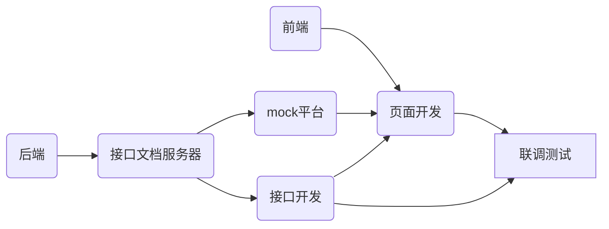

# 前后端分离

## Introduction

- 前后端仅仅通过**异步接口**来编程
- 前后端都有自己的开发流程、构建工具和测试集合
- 关注分离点，前后端变得相对独立并松耦合

| **后端**             | **前端**            |
| -------------------- | ------------------- |
| 提供数据             | 接收数据，返回数据  |
| 处理业务逻辑         | 处理渲染逻辑        |
| Service-side MVC架构 | Client-side MV*架构 |
| 代码跑在服务器上     | 代码跑在客户端上    |

## 如何分离

### 开发流程

- 后端编写和维护接口文档，在 API 变化时更新接口文档
- 后端根据接口文档进行接口开发
- 前端根据接口文档进行开发 + Mock平台
- 开发完成后联调和提交测试

Mock 服务器根据接口文档自动生成 Mock 数据，实现了接口文档即API：



### API管理系统

前后端分离优势多多，其中一个很重要的优势是：对于后台服务（系统）来讲，**只需提供一套统一的API接口**，可被多个客户端所**复用**，分工和协作被细化，大大提高了效率。

与此同时带来的一些副作用便是：

- **接口文档管理混乱**。之前很多公司管理API接口，有用Wiki的，有Word文档的，有Html的，经常遇到问题是接口因变了，比如增加参数，参数名变了，参数被删除了等都没有及时更新文档的情况
- **接口测试没有保障**。毕竟前端开发依赖后端接口，如果前后端开发不同步，接口及时测试成了问题，因此需要随时提供一套可用的API接口数据测试服务。
- **资源分散，难以共享**。每个开发者维护自己的一套测试接口集合，无法共用他人接口集合，开发过程中充斥着大量重复造数据、填接口的工作，效率不高。
- **其他问题**。除此之外还有可能碰到诸如 文档导出、接口分类规划、操作便利性等一系列问题。

相应的API文档系统有：

- Swagger:
  - Swagger 是一个规范和完整的框架，用于生成、描述、调用和可视化 RESTful 风格的 Web 服务。它可以方便地和 Spring MVC、Spring Boot等框架进行快速整合，并且通过结合诸如**Swagger-UI**等组件，将 `controller`层的方法进行方便地**可视化展示**，像方法注释，方法参数，方法返回值等都提供了相应的用户界面。
  - https://swagger.io/
- YApi
- showDoc

## 开发准则

1. 避免后端渲染：客户端渲染，数据使用全ajax交互。

2. 避免大量线上调试

3. 规范接口文档：好的API文档应当有以下信息

   - 格式简洁清晰
   - 分组：当接口很多的时候，分组就很必要了
   - 接口名、接口描述、接口地址
   - http 方法、参数、headers、是否序列化
   - http 状态码、响应数据

4. 本地接口模拟开发：本地接口模拟就是在本地模拟一个与服务器差不多的环境，能够提供数据所需的接口，进行错误模拟处理等等。

   - 以下为常用的库：

   - **browser-sync**: 能让浏览器实时、快速响应文件更改（ `html`、 `js`、 `css`、 `sass`、 `less` 等）并自动刷新页面，并且可以同时在PC、平板、手机等设备下进行调试。
   - **webpack-dev-middleware**: A development middleware for webpack
   - **webpack-hot-middleware**: 热更新本地开发浏览器服务

5. 前后端并行开发

6. 去缓存：在前端需要做好去除缓存的功能，

   - 传统的去缓存是在静态资源 url 上加上版本号或者时间戳，不过因为构建工具的出现以及一些浏览器已经不支持这种方式了的缘故，这种方式已经是过去时了。

   - 现在去缓存是将文件 hash 化命名，只要文件变动，文件名就会不一样，以此才能彻底的去缓存。如果使用 **webpack工具** 进行打包，会自动将所有文件进行 hash 化命名。

7. 做好错误处理

   - 一般前端的错误分为：

     - 脚本运行错误：js 脚本错误，找到堆栈信息，然后解决

     - 接口错误：服务器报错、数据返回不对、没有响应数据、超时等

   - 而后端的错误分为：

     - 状态码错误：服务器报错、超时等

     - 数据错误：没有响应数据、数据格式不对、数据内容不对

8. 运行时捕捉js脚本错误

## 接口规范

**规范原则**

> - 接口返回数据即显示：前端仅做渲染逻辑处理；
> - 渲染逻辑禁止跨多个接口调用；
> - 前端关注交互、渲染逻辑，尽量避免业务逻辑处理的出现；
> - 请求响应传输数据格式：JSON，JSON数据尽量简单轻量，避免多级JSON的出现；

**基本格式示例**

> 可根据业务和编码习惯做些许调整，并非强制性。

数据类型：

- Boolean类型：JSON传输中一律使用1/0表示；
- 时间日期类型：JSON传输中一律使用字符串；

响应基本格式：

后端统一返回 CommonResult 对象

* data：具体响应的其他信息
* resp_code：响应码，目前0是成功、1是失败
* resp_msg：响应消息

```json
{
  	resp_code: 200,
  	resp_msg: "success"
  	data: {}
}
```

特殊内容：下拉框、复选框、单选框

禁止下拉框、复选框、单选框判定选中逻辑由前端来处理，统一由后端逻辑判定选中返回给前端展示；

## Reference

- [API管理系统推荐](https://mp.weixin.qq.com/s?__biz=MzU4ODI1MjA3NQ==&mid=2247484489&idx=1&sn=8d59a12d27de5c50776d1a9967890a7e&chksm=fdded28dcaa95b9b1798009f7b9df7f0381573ad52d7903361687796ca4a7b071024e0085e1e&scene=21#wechat_redirect)
- [开发准则](https://mp.weixin.qq.com/s/niYHlrCDIkA1NqPVI_VJ8w)