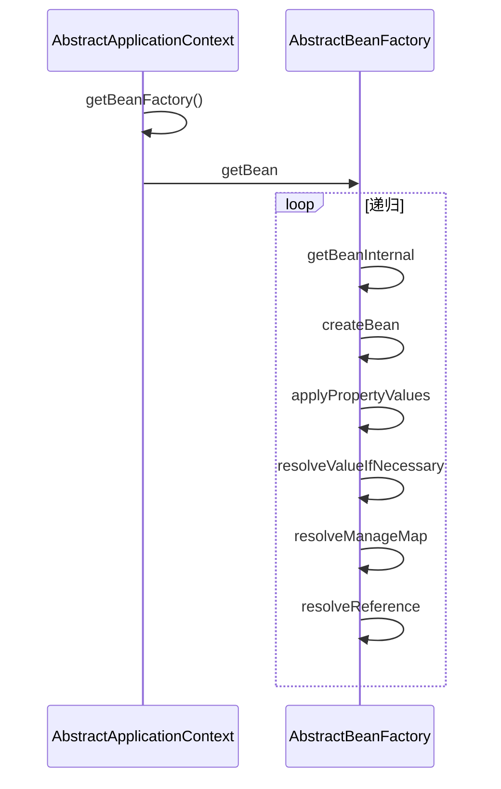

# Spring核心概念梳理

## Introduction

针对Spring的几个核心概念进行梳理。

- SpringBoot框架的启动流程与相应注解。
- IOC与AOP两大Spring容器的核心功能和相应注解。
- Spring相应注解。
- Spring相应问题。

IOC与AOP理解简述：

> IOC 叫做控制反转，指的是通过Spring来管理对象的创建、配置和生命周期，这样相当于把控制权交给了Spring，不需要人工来管理对象之间复杂的依赖关系，这样做的好处就是解耦。在Spring里面，主要提供了 BeanFactory 和 ApplicationContext 两种 IOC 容器，通过他们来实现对 Bean 的管理。
>
> AOP 叫做面向切面编程，他是一个编程范式，目的就是提高代码的模块性。Srping AOP 基于动态代理的方式实现，如果是实现了接口的话就会使用 JDK 动态代理，反之则使用 CGLIB 代理，Spring中 AOP 的应用主要体现在 事务、日志、异常处理等方面，通过在代码的前后做一些增强处理，可以实现对业务逻辑的隔离，提高代码的模块化能力，同时也是解耦。Spring主要提供了 Aspect 切面、JoinPoint 连接点、PointCut 切入点、Advice 增强等实现方式。

## Spring Boot

### 简介

*这里谈论的Spring Boot基于官方version2.6.4 doc*

> Spring Boot makes it easy to create stand-alone, production-grade Spring based Applications that you can "just run".
>
> 即Spring Boot就是为了更方便去构建Spring应用。

**Features**

- Create stand-alone Spring applications
- Embed Tomcat, Jetty or Undertow directly (no need to deploy WAR files)
- Provide opinionated 'starter' dependencies to simplify your build configuration
- Automatically configure Spring and 3rd party libraries whenever possible
- Provide production-ready features such as metrics, health checks, and externalized configuration
- Absolutely no code generation and no requirement for XML configuration

### SpringBoot的启动

Spring Boot项目在主类`main()`方法，通过`SpringApplication.run(XXApplication.class, args);`仅可以完成项目的启动，该节追溯该SpringApplication和run()的底层，探寻启动流程。

`SpringApplication`属于SpringBoot的本身产物，封装了对Spring的启动。

SpringApplication实例化代码：(构造函数)

```java
    public SpringApplication(ResourceLoader resourceLoader, Class<?>... primarySources) {
        this.sources = new LinkedHashSet();
        this.bannerMode = Mode.CONSOLE;
        this.logStartupInfo = true;
        this.addCommandLineProperties = true;
        this.addConversionService = true;
        this.headless = true;
        this.registerShutdownHook = true;
        this.additionalProfiles = Collections.emptySet();
        this.isCustomEnvironment = false;
        this.lazyInitialization = false;
        this.applicationContextFactory = ApplicationContextFactory.DEFAULT;
        this.applicationStartup = ApplicationStartup.DEFAULT;
        this.resourceLoader = resourceLoader;
        Assert.notNull(primarySources, "PrimarySources must not be null");
        this.primarySources = new LinkedHashSet(Arrays.asList(primarySources));
        this.webApplicationType = WebApplicationType.deduceFromClasspath();
        this.bootstrapRegistryInitializers = this.getBootstrapRegistryInitializersFromSpringFactories();
        this.setInitializers(this.getSpringFactoriesInstances(ApplicationContextInitializer.class));
        this.setListeners(this.getSpringFactoriesInstances(ApplicationListener.class));
        this.mainApplicationClass = this.deduceMainApplicationClass();
    }
```


- webApplicationType：推断应用类型，通过classpath来推断当前项目使用的是哪一种类型
  WebApplicationType.NONE，WebApplicationType.SERVLET，WebApplicationType.REACTIVE。
- bootstrapRegistryInitializers引导程序注册的初始化器：初始化bootstrapRegistryInitializers引导程序注册的初始化器，从`META-INF/spring.factories`配置文件中，获取Bootstrapper.class和BootstrapRegistryInitializer.class这两个配置类型，然后合并存储在bootstrapRegistryInitializers中。
- `this.Initializers()`应用上下文初始化器：使用`SpringFactoriesLoader`查找并加载`classpath:META-INF/spring.factories`文件中所有可用的 `ApplicationContextInitializer`。
- `this.setListerners()`： 使用`SpringFactoriesLoader`查找并加载`classpath下META-INF/spring.factories`文件中的所有可用的 `ApplicationListener`。
- mainApplication：推断并设置`main()`方法的定义类。

步骤精简如下：

1. 通过 `SpringFactoriesLoader` 加载 `META-INF/spring.factories` 文件，获取并创建 `SpringApplicationRunListener` 对象
2. 然后由 `SpringApplicationRunListener` 来发出 `starting` 消息
3. 创建参数，并配置当前 `SpringBoot` 应用将要使用的 `Environment`
4. 完成之后，依然由 `SpringApplicationRunListener` 来发出 `environmentPrepared` 消息
5. 创建 `ApplicationContext`
6. 初始化 `ApplicationContext`，并设置 `Environment`，加载相关配置等
7. 由 `SpringApplicationRunListener` 来发出 `contextPrepared` 消息，告知Spring Boot 应用使用的 `ApplicationContext` 已准备OK
8. 将各种 `beans` 装载入 `ApplicationContext`，继续由 `SpringApplicationRunListener` 来发出 `contextLoaded` 消息，告知 Spring Boot 应用使用的 `ApplicationContext` 已装填OK
9. `refresh ApplicationContext`，完成IoC容器可用的最后一步
10. 由 `SpringApplicationRunListener` 来发出 `started` 消息
11. 调用`callRunners(...)`方法，让实现了`ApplicationRunner`和`CommandLineRunner`接口类的`run` 方法得以执行，用于在 Spring 应用上下文准备完毕后，执行一些额外操作。从而完成最终的程序的启动。
12. 由 `SpringApplicationRunListener` 来发出 `running` 消息，告知程序已运行起来了

### @SpringBootApplication注解

源码如下：

```java
@Target(ElementType.TYPE)
@Retention(RetentionPolicy.RUNTIME)
@Documented
@Inherited
@SpringBootConfiguration
@EnableAutoConfiguration
@ComponentScan(excludeFilters = { @Filter(type = FilterType.CUSTOM, classes = TypeExcludeFilter.class),
		@Filter(type = FilterType.CUSTOM, classes = AutoConfigurationExcludeFilter.class) })
public @interface SpringBootApplication { ... }
```

可以很明显的发现这是一个复合注解，其中三个重要的注解为：

- @SpringBootConfiguration
- @EnableAutoConfiguration
- @ComponentScan

#### @SpringBootConfiguration

源码如下：

```java
@Target({ElementType.TYPE})
@Retention(RetentionPolicy.RUNTIME)
@Documented
@Configuration
@Indexed
public @interface SpringBootConfiguration {
    @AliasFor(
        annotation = Configuration.class
    )
    boolean proxyBeanMethods() default true;
}

```

这里说明`@SpringBootConfiguration`也是来源于`@Configuration`，都是将当前累标注为代理类，并将当前累以`@Bean`注解标记的方法注入到Spring容器中，实例名即为方法名。

#### @EnableAutoConfiguration

源码如下：

```java
@Target(ElementType.TYPE)
@Retention(RetentionPolicy.RUNTIME)
@Documented
@Inherited
@AutoConfigurationPackage
@Import(AutoConfigurationImportSelector.class)
public @interface EnableAutoConfiguration { ... }
```

该注解帮助SpringBoot应用将所有符合条件的`@Configuration`配置都加载到当前IoC容器中，如：


总的来说，从 `ClassPath`下扫描所有的 `META-INF/spring.factories` 配置文件，并将`spring.factories`文件中的 `EnableAutoConfiguration`对应的配置项通过反射机制实例化为对应标注了 `@Configuration` 的形式的IoC配置类，然后注入IoC容器。

#### @ComponentScan

用于将一些标注了特定注解的bean定义批量采集注册到Spring的IoC容器中，这些注解常见有：

- @Controller
- @Entity
- @Component
- @Service
- @Repository
- …

## IoC

### 介绍

Spring框架提供的很重要的一个作用就是IoC容器，而这里的容器就是指为某种特定组件的运行提供一个必要的软件环境，例如Tomcat就是一个Servlet容器，可以为Servlet提供运行时。通常来说，使用容器运行组件，除了提供一个组件的运行时，还提供了许多底层服务，如Servlet的底层实现了TCP连接、HTTP协议解析等复杂服务，若没有容器来提供这些服务，也没法使我们简单的编写Servlet代码。

Spring的核心就是IoC容器，可以管理所有轻量级的JavaBean组件，提供底层服务包括组件的生命周期管理、配置和组装服务、AOP支持等。

### IoC原理

IoC（Inverse of Control：控制反转）是一种设计思想，**就是将原本在程序中手动创建对象的控制权，交给由Spring框架管理。**IoC容器是Spring用来实现IoC的载体，IoC容器实际上就是个Map，Map中存放的是各种对象。

将对象之间的相互依赖关系交给IoC容器管理，并由IoC容器完成对象的注入。即很大程度的简化了应用的开发，把应用从复杂的依赖关系中解放出来。**IoC容器就像一个工厂，当我们需要创建一个对象的时候，只需要配置好配置文件/注解，完全不用考虑对象如何被创建。**

>  在实际项目中一个 Service 类可能有几百甚至上千个类作为它的底层，假如我们需要实例化这个 Service，你可能要每次都要搞清这个 Service 所有底层类的构造函数，这可能会把人逼疯。如果利用 IoC 的话，你只需要配置好，然后在需要的地方引用就行了，这大大增加了项目的可维护性且降低了开发难度。
>
>  Spring 时代我们一般通过 XML 文件来配置 Bean，后来开发人员觉得 XML 文件来配置不太好，于是 SpringBoot 注解配置就慢慢开始流行起来。

#### 依赖倒置原理

把原本的高层建筑依赖底层建筑“倒置”过来，变成底层建筑依赖高层建筑。高层建筑决定需要什么，底层去实现这样的需求，但是高层并不用管底层是怎么实现的。这样就不会出现前面的“牵一发动全身”的情况。

**控制反转（Inversion of Control）** 就是**依赖倒置**原则的一种代码设计的思路。具体采用的方法就是所谓的**依赖注入（Dependency Injection）**，它解决的最主要的一个问题就是：将组件的创建+配置与组件的使用分离，并且，由IoC容器负责管理组件生命周期。

#### 核心思想

**Inverseion of Control的最核心的思想就是，资源不由使用资源的双方管理，而由不使用资源的第三方管理。**

这里有个很棒的例子：

就是甲方要达成某种目的不需要直接依赖乙方，只需要将目的告诉给第三个。例如甲方需要一台电脑，乙方卖一台电脑，乙方要将电脑卖出去也不需要找到甲方，也只需要将电脑寄托到淘宝（电商平台）去告诉我要卖一台电脑。这样甲乙双方进行交易活动，都不需要自己去找互相，相当于程序内部开放接口，而卖家由第三方作为参数传入。甲乙不相互依赖，只有在交易的时候产生联系，反之亦然，解决了甲乙直接进行交易之间的不信任，因为交易由第三方负责联系。

- 而所谓的依赖注入，就是甲方开发接口，在需要的时候，将乙方注入进来。
- 而所谓的控制反转，就是甲乙双方不互相依赖，交易活动的进行不依赖于互相，整个活动的进行全部由第三方负责管理。

### IoC功能

IoC支持以下功能：

- 依赖注入
- 依赖检查
- 自动装配
- 支持集合
- 制定初始化方法和销毁方法
- 支持回调某些方法（但是需要实现Spring接口，有侵入性）

对于IoC来说，最重要的就是容器，容器管理着Bean的生命周期，控制着Bean的依赖注入。

#### 容器

Spring 作者 Rod Johnson 设计了两个接口用以表示容器。

- **BeanFactory**
- **ApplicationContext**

`BeanFactory` 粗暴简单，可以理解为就是个 HashMap，Key 是 BeanName，Value 是 Bean 实例。通常只提供注册（put），获取（get）这两个功能。我们可以称之为 “**低级容器**”。

`ApplicationContext` 可以称之为 “**高级容器**”。因为他比 BeanFactory 多了更多的功能。他继承了多个接口。因此具备了更多的功能。例如资源的获取，支持多种消息（例如 JSP tag 的支持），对 BeanFactory 多了工具级别的支持等待。所以你看他的名字，已经不是 BeanFactory 之类的工厂了，而是 “应用上下文”， 代表着整个大容器的所有功能。该接口定义了一个 refresh 方法，此方法是所有阅读 Spring 源码的人的最熟悉的方法，用于刷新整个容器，即重新加载/刷新所有的 bean。

**低级容器**与**高级容器**关系如下：


- 下面的 3 个绿色的，都是功能扩展接口，不展开讲
- 看下面的隶属 `ApplicationContext` 粉红色的 “高级容器”，依赖着 “低级容器”，这里说的是依赖，不是继承哦。他依赖着 “低级容器” 的 `getBean` 功能。而高级容器有更多的功能：支持不同的信息源头，可以访问文件资源，支持应用事件（Observer 模式）。通常用户看到的就是 “高级容器”。但 BeanFactory 也非常够用啦！
- 左边灰色区域的是 “低级容器”， 只负载加载 Bean，获取 Bean。容器其他的高级功能是没有的。例如上图画的 `refresh` 刷新 Bean 工厂所有配置。生命周期事件回调等。

### IoC启动过程

IoC启动，即`ClassPathXmlApplicationContext`（简称CPAC）的构造过程。

1. 用户构造CPAC。
2. CPAC 首先访问了 “抽象高级容器” 的 final 的 `refresh` 方法，这个方法是模板方法。所以要回调子类（低级容器）的 `refreshBeanFactory` 方法，这个方法的作用是使用低级容器加载所有 `BeanDefinition` 和 `Properties`到容器中。
3. 低级容器加载成功后，高级容器开始处理一些回调，例如 Bean 后置处理器。回调 `setBeanFactory` 方法。或者注册监听器等，发布事件，实例化单例 Bean 等等功能，这些功能。

即通俗来说：

1. 低级容器 加载配置文件（xml、数据库、applet），并解析成`BeanDefinition`到低级容器中。
2. 加载成功后，高级容器启动高级功能，例如接口回调、监听器、自动实例化单例、发布事件等等功能。

当容器创建好，就会使用`getBean`方法，获取Bean，而`getBean`的流程如下：



可以看出，`getBean`操作都是在低级容器里操作的，而这个递归操作指：但BeanA依赖于BeanB，而这个BeanA加载的时候，其配置的`ref="Bean_B"在解析的时候只是一个占位符`，被放入BeanA的属性集合中，当调用`getBean`的时候，需要真正BeanB注入到BeanA时，就需要冲容器中获取该`Bean_B`，因此产生了递归。

> 为什么不是在加载的时候直接注入？
>
> 因为加载的顺序不同，很可能BeanA依赖的BeanB没有加载好，就无法从容器中获取。因此，Spring将其分为了两个步骤：
>
> 1. 加载所有Bean配置成`BeanDefinition`到容器，如果Bean有依赖关系，则使用占位符暂时代替。
> 2. 然后，在调用 `getBean` 的时候，进行真正的依赖注入，即如果碰到了属性是 `ref` 的（占位符），那么就从容器里获取这个 Bean，然后注入到实例中 —— 称之为依赖注入。

依赖注入实际上只需要“低级容器”就可以实现。

### Bean的生命周期

Spring Bean的生命周期可以简单概括为4个步骤：

1. 实例化，创建一个Bean对象
2. 填充属性，为属性赋值
3. 初始化
   - 如果实现了`xxxAware`接口，通过不同类型的Aware接口拿到Spring容器的资源
   - 如果实现了`BeanPostProcessor`接口，则会回调该接口的`postProcessBeforeInitialzation`和`postProcessAfterInitialization`方法
   - 如果配置了`init-method`方法，则会执行`init-method`配置的方法
4. 销毁
   - 容器关闭后，如果Bean实现了`DisposableBean`接口，则会回调该接口的`destroy`方法
   - 如果配置了`destroy-method`方法，则会执行`destroy-method`配置的方法

### 相关注解

**这里只会提及注解的方式：**

- @Autowired：使用`@Autowired`就相当于把指定类型的Bean注入到指定的字段中
  - @Autowired(required = false)：Spring如果没有找到对应类型的Bean，它会抛出`NoSuchBeanDefinitionException`异常，可以通过该方式，若找不到就忽略
- @Compoent：相当于定义了一个Bean
  - @Scope：默认为单例，可以修改成`@Scope(ConfigurableBeanFactory.SCOPE_PROTOTYPE)`，即`@Scope("prototype")`
- @CompoentScan：过把所有标注为`@Component`的Bean自动创建出来，并根据`@Autowired`进行装配
- @Configuration：标注是一个配置类，其主要目的是作为bean定义的源
- @Bean：通过在`@Configuration`的配置类中创建第三方Bean
  - @Qualifier(“name”)：若Bean的类型相同，而容器只会创建一个实例，就需要使用别名来进行区分：`@Bean("name")`，这时候在使用的时候需要通过`@Qualifier("name")`来指定注入的Bean
  - @Primary：或者通过该注解设置为主要Bean
- @Order：场景：有些时候，我们会有一系列接口相同，不同实现类的Bean。因为Spring是通过扫描classpath获取所有的Bean，这时候可以通过该注解定义Bean添加顺序。
- @PostContruct和`init()`：调用标记有`@PostConstruct`的`init()`方法进行初始化。
- @PreDestory和`shutdown()`：而销毁时，容器会首先调用标记有`@PreDestroy`的`shutdown()`方法。

## AOP

### 介绍

AOP(Aspect-Oriented Programming：面向切面编程)，通过**预编译方式和运行期动态代理**实现程序功能的统一维护的一种技术。利用AOP可以对业务逻辑的各个部分进行隔离，从而使得业务逻辑各部分之间的耦合度降低，提高程序的可重用性，同时提高了开发的效率。

**主要功能：让关注点代码与业务代码分离**。

**面向切面编程：对很多功能具有重复代码抽取，再在运行的时候往业务方法上动态注入“切面类代码”**。

在Java上，对于AOP的织入由三种方式：

1. 编译器：在编译时，由编译器把切面调用编译进字节码，这种方式需要定义新的关键字并拓展编译器，AspectJ就扩展了Java编译器，使用关键字aspect来实现织入；
2. 类加载器：在目标类被装载到JVM时，通过一个特殊的类加载器，对目标类的字节码重新“增强”；
3. 运行期：目标对象和切面都是普通Java类，通过JVM的动态代理功能或者第三方库实现运行期动态织入。

最简单的就是第三种返回式，Spring的AOP实现就是基于JVM的动态代理。由于JVM的动态代理要求必须实现接口，如果一个普通类没有业务接口，就需要通过[CGLIB](https://github.com/cglib/cglib)或者[Javassist](https://www.javassist.org/)这些第三方库实现。

### 术语&案例

AOP中的常用术语：

- Aspect：切面，即一个横跨多个核心逻辑的功能，或者成为系统关注点
- Joinpoint：连接点，定义在应用程序流程的何处插入Aspect的执行
- Pointcut：切入点，即一组连接点的集合
- Advice：增强，指特定Joinpoint上执行的动作
- Introduction：引介，指一个已有的Java对象动态地增加新的接口
- Weaving：织入，将Aspect整合到程序的执行流中
- Interceptror：拦截器，一种实现Advice的方法
- Traget Object：目标对象，即真正执行业务的核心逻辑对象
- AOP Proxy：AOP代理，是客户端持有的增强后的对象引用

```java
@Aspect
@Component
public class LoggingAspect {
    // 在执行UserService的每个方法前执行:
    @Before("execution(public * com.itranswarp.learnjava.service.UserService.*(..))")
    public void doAccessCheck() {
        System.err.println("[Before] do access check...");
    }

    // 在执行MailService的每个方法前后执行:
    @Around("execution(public * com.itranswarp.learnjava.service.MailService.*(..))")
    public Object doLogging(ProceedingJoinPoint pjp) throws Throwable {
        System.err.println("[Around] start " + pjp.getSignature());
        Object retVal = pjp.proceed();
        System.err.println("[Around] done " + pjp.getSignature());
        return retVal;
    }
}
```

拦截器类型：

- @Before：这种拦截器先执行拦截代码，再执行目标代码。如果拦截器抛异常，那么目标代码就不执行了；
- @After：这种拦截器先执行目标代码，再执行拦截器代码。无论目标代码是否抛异常，拦截器代码都会执行；
- @AfterReturning：和@After不同的是，只有当目标代码正常返回时，才执行拦截器代码；
- @AfterThrowing：和@After不同的是，只有当目标代码抛出了异常时，才执行拦截器代码；
- @Around：能完全控制目标代码是否执行，并可以在执行前后、抛异常后执行任意拦截代码，可以说是包含了上面所有功能。

### Spring AOP和AspectJ AOP区别

Spring AOP基于动态代理实现，属于运行时增强。

AspectJ则属于编译时增强，主要有三种方式：

1. 编译时织入：指的是增强的代码和源代码我们都有，直接使用 AspectJ 编译器编译就行了，编译之后生成一个新的类，他也会作为一个正常的 Java 类装载到JVM。
2. 编译后织入：指的是代码已经被编译成 class 文件或者已经打成 jar 包，这时候要增强的话，就是编译后织入，比如你依赖了第三方的类库，又想对他增强的话，就可以通过这种方式。
3. 加载时织入：指的是在 JVM 加载类的时候进行织入。

## Spring启动监听

### 概览

*该小节，主要说明Spring容器启动时实现自己的逻辑，如创建定时任务、创建连接池等。*

主要针对以下几种Spring启动监听方式：

- Bean 构造函数方式
- 使用 @PostConstruct 注解
- 实现 InitializingBean 接口
- 监听 ApplicationListener 事件
- 使用 Constructor 注入方式

### 原始方式

倘若没有Spring，回归Java本身，可以在静态代码块，在类构造函数中实现相应的逻辑，Java类的初始化顺序依次是：**静态变量 -> 静态代码块 -> 全局变量 -> 初始化代码块 -> 构造器**

### @PostConstruct

通过`@PostConstruct`在Bean初始化后实现相应的初始化逻辑，`@PostConstruct`修饰的方法将在Bean初始化完成之后执行，此时Bean的依赖也已经注入完成，因此可以在方法中调用注入的依赖Bean:

```java
@Component
public class CustomBean {
  	@Autowired
  	private Environment env;
		@PostConstruct
  	public void init() {
      	env.getActiveProfiles();
    }
}
```

与`@PostConstruct`相对应的，如果想在 Bean 注销时完成一些清扫工作，如关闭线程池等，可以使用`@PreDestroy`注解：

```java
@Component
public class CustomBean {
    @Autowired
    private ExecutorService executor = Executors.newFixedThreadPool(1)
		@preDestory
  	public void destroy() {
      	executor.close();
    }
}
```

### InitializingBean

实现Spring的`InitializingBean`接口同样可以实现以上在 Bean 初始化完成之后执行相应逻辑的功能。实现`InitializingBean`接口，在`afterPropertiesSet`方法中实现逻辑。

### ApplicationListener

我们可以在 Spring 容器初始化的时候实现我们想要的初始化逻辑。这时我们就可以使用到 Spring 的初始化事件。Spring 有一套完整的事件机制，在 Spring 启动的时候，Spring 容器本身预设了很多事件，在 Spring 初始化的整个过程中在相应的节点触发相应的事件，我们可以通过监听这些事件来实现我们的初始化逻辑。Spring 的事件实现如下：

- ApplicationEvent，事件对象：由 ApplicationContext 发布，不同的实现类代表不同的事件类型。
- ApplicationListener，监听对象：任何实现了此接口的 Bean 都会收到相应的事件通知。实现了 ApplicationListener 接口之后，需要实现方法 `onApplicationEvent()`，在容器将所有的 Bean 都初始化完成之后，就会执行该方法。

与 Spring Context 生命周期相关的几个事件有以下几个：

- ApplicationStartingEvent: 这个事件在 Spring Boot 应用运行开始时，且进行任何处理之前发送（除了监听器和初始化器注册之外）。
- ContextRefreshedEvent: ApplicationContext 被初始化或刷新时，该事件被发布。这也可以在 ConfigurableApplicationContext 接口中使用 refresh() 方法来发生。
- ContextStartedEvent: 当使用 ConfigurableApplicationContext 接口中的 start() 方法启动 ApplicationContext 时，该事件被触发。你可以查询你的数据库，或者你可以在接受到这个事件后重启任何停止的应用程序。
- ApplicationReadyEvent: 这个事件在任何 application/ command-line runners 调用之后发送。
- ContextClosedEvent: 当使用 ConfigurableApplicationContext 接口中的 close() 方法关闭 ApplicationContext 时，该事件被触发。一个已关闭的上下文到达生命周期末端；它不能被刷新或重启。
- ContextStoppedEvent: Spring 最后完成的事件。

因此，如果我们想在 Spring 启动的时候实现一些相应的逻辑，可以找到 Spring 启动过程中符合我们需要的事件，通过监听相应的事件来完成我们的逻辑：

```java
@Component
@Slf4j
public class StartupApplicationListenerExample implements ApplicationListener<ContextRefreshedEvent> {

    @Override
    public void onApplicationEvent(ContextRefreshedEvent event) {
        log.info("Subject ContextRefreshedEvent");
    }
}
```

除了通过实现`ApplicationListener`接口来监听相应的事件，Spring 的事件机制也实现了通过`@EventListener`注解来监听相对应事件：

```java
@Component
@Slf4j
public class StartupApplicationListenerExample {

    @EventListener
    public void onApplicationEvent(ContextRefreshedEvent event) {
        log.info("Subject ContextRefreshedEvent");
    }
}
```

### 构造器Constructor注入

在成员变量上通过`@Autoware`注解注入依赖 Bean，但是在 Bean 的构造函数函数中却无法使用到注入的 Bean（因为 Bean 还未注入），其实我们也是使用 Spring 的构造函数注入方式， 这也是 Spring 推荐的注入机制（在我们使用 IDEA 的时候，如果没有关闭相应的代码 Warning 机制，会发现在成员变量上的`@Autoware`是黄色的，也就是 idea 不建议的代码）。Spring 更推荐构造函数注入的方式：

```java
@Component
public class CustomBean {
  	private final Environment env;
		
    @Autowired
    public LogicInConstructorExampleBean(Environment environment) {
        this.environment = environment;
        log.info(Arrays.asList(environment.getDefaultProfiles()));
    }
}
```

## 常见问题

### Spring循环依赖问题

「What」Spring循环依赖问题是什么？有三种情况：

1. 自己依赖自己
2. 两个对象之间相互直接依赖
3. 多个对象之间相互间接依赖

如场景：

```java
@Service
public class TestService1 { // A
  	@Autowired
  	TestService2 testService2;
}
@Service
public class TestService2 { // B
  	@Autowired
  	TestService1 testService1;
}
```

是一个很明显的循环依赖，但得益于spring的内部机制，让我们根本无法感知它有问题，因为spring默默帮我们解决了。

Spring解决循环依赖的两个前提条件：

1. 不全是构造器方式的循环依赖
2. 必须是单例

解决循环依赖的方式就是**三级缓存**，通过三级缓存提前拿到未初始化的对象。：

- singletonObjects 一级缓存，用于保存实例化、注入、初始化完成的bean实例。
- earlySingletonObjects 二级缓存，用于保存实例化完成的bean实例，但是未初始化完成的对象。
- singletonFactories 三级缓存，用于保存bean对象工厂，提供匿名内部类，用于创建二级缓存中的对象。


A对象的创建过程如下：

1. 创建对象A，实例化时将A放入三级缓存。
2. A注入属性，发现依赖B，转而初始化B。
3. 同样创建对象B，注入属性时发现依赖A，依次从一级到三级缓存查询A，从三级缓存的对象工程拿到A，将A放入二级缓存，同时删除三级缓存的A，此时B已经实例化并初始化成功，将B放入一级缓存。
4. 接着继续创建A，顺利从一级缓存中拿到B，A也实例化并初始化完成，同时删除二级缓存中的A，并放入到一级缓存中。
5. 最后，一级缓存都保留了完成后的A，B

Reference：https://mp.weixin.qq.com/s/m2DrtDxBzShtNF2Uk6zSAg

### 为什么需要三级？二级缓存不行么？

不可以，主要是为了生成代理对象。因为三级缓存中放的是生成具体对象的匿名内部类，他可以生成代理对象，也可以是普通的实例对象。

使用三级缓存主要是为了保证不管什么时候使用的都是一个对象。

假设只有二级缓存的情况，往二级缓存中放的显示一个普通的Bean对象，`BeanPostProcessor`去生成代理对象之后，覆盖掉二级缓存中的普通Bean对象，那么多线程环境下可能取到的对象就不一致了。

## 常见注解

### @Value

通过`@Value`可以将指定的配置属性，注入到字段中。该注解指定的系统属性名，必须与配置文件相同。

使用的时候会出现如下问题：

1. 编码问题：若使用`.properties`进行配置，SpringBoot会使用`CharacterReader`类负责读取，默认编码格式为`ISO-8859-1`，因此使用中文会出现乱码；而若使用`.yml/.yaml`配置，最终会使用`UnicodeReader`类进行解析，它的`init`会读取BOM文件头，并采用相应的编码，默认为`UTF-8`。
2. 默认值的问题：场景，在Business层包含了UserService类，被API和JOB服务引用，但是`@Value`只被API服务引用，而JOB服务找不到该属性，因此为了避免启动报错，最好设置一个默认值`@Value(value = "${djj.test.username:djj}")`，通过‘:’来设置。
3. `static`修饰的字段不可使用。
4. 注意`${}`和`#{}`的区别，`#{}`是获取Bean的属性或调用某个方法，`${}`主要是获取配置属性。

更多细节参考：https://mp.weixin.qq.com/s/LGYSChfDLKuCQVMYGi0Omg

### @Autowired

将`@Autowired`标注在类文件中的字段属性上，通过该方式，Spring容器启动时会寻找到相应的**Bean**，通过反射的方式注入到这个字段中。

若采用构造方法，若该类不存在无参构造，仅存在有参的构造函数，Spring也会注入相应的属性。

最后一种方式，Spring 可以使用 `@Autowired` 标注 `Array` (数组)，`Collections`(集合)，甚至是 `Map` (散列表)，通过这种方式注入多个相同类型的 `Bean`。

若需要指定里面的排序优先级，就需要使用`@Order`或者`@Priority`指定以下优先级，其中`@Order/@Priority`的值越小，优先级越高。

> 这里注意，Spring中将先初始化Bean，然后调用类的构造函数，其次再注入成员变量依赖的Bean(@Autowired或@Resource)。

### @Transactional

添加位置：

1. 接口实现类 或 接口方法上 而不是接口类中
2. 访问权限：public的方法才起作用。Spring AOP的本质决定（**本质跟AOP调用有关：在事务代理对象中有判断代理的方法必须是public修饰，否则返回null**）。

系统设计：将标签放置在需要进行事务管理的方法上，而不是放在所有接口实现类上：只读的接口就不需要事务管理，由于配置了@Transactional就需要AOP拦截及事务的处理，可能影响系统性能。

错误使用：

> 1.接口中A、B两个方法，A无@Transactional标签，B有，上层通过A间接调用B，此时事务不生效。
>
> 2.接口中异常（运行时异常）被捕获而没有被抛出。
> 默认配置下，spring 只有在抛出的异常为运行时 unchecked 异常时才回滚该事务，
> 也就是抛出的异常为RuntimeException 的子类(Errors也会导致事务回滚)，
> 而抛出 checked 异常则不会导致事务回滚 。可通过 @Transactional rollbackFor进行配置。
>
> 3.多线程下事务管理因为线程不属于 spring 托管，故线程不能够默认使用 spring 的事务,也不能获取spring 注入的 bean 。
> 在被 spring 声明式事务管理的方法内开启多线程，多线程内的方法不被事务控制。
> 一个使用了@Transactional 的方法，如果方法内包含多线程的使用，方法内部出现异常，不会回滚线程中调用方法的事务。

@Transactional 实质是使用了 JDBC 的事务来进行事务控制的
@Transactional 基于 Spring 的动态代理的机制

> @Transactional 实现原理：
>
> 1) 事务开始时，通过AOP机制，生成一个代理connection对象，
>    并将其放入 DataSource 实例的某个与 DataSourceTransactionManager 相关的某处容器中。
>    在接下来的整个事务中，客户代码都应该使用该 connection 连接数据库，
>    执行所有数据库命令。
>    [不使用该 connection 连接数据库执行的数据库命令，在本事务回滚的时候得不到回滚]
>     （物理连接 connection 逻辑上新建一个会话session；
>    DataSource 与 TransactionManager 配置相同的数据源）
> 2) 事务结束时，回滚在第1步骤中得到的代理 connection 对象上执行的数据库命令，
>    然后关闭该代理 connection 对象。
>     （事务结束后，回滚操作不会对已执行完毕的SQL操作命令起作用）

## 实践功能


### @Autowird注入与构造函数注入

Spring4.3+后，constructor注入支持非显示注入方式。事实上，spring在4.x版本后就推荐使用构造器的方式的来注入fileld。

官方推荐理由：

- 单一职责: 当使用构造函数注入的时候，你会很容易发现参数是否过多，这个时候需要考虑你这个类的职责是否过大，考虑拆分的问题；而当使用@Autowired注入field的时候，不容易发现问题

- 依赖不可变: 只有使用构造函数注入才能注入final

- 依赖隐藏: 使用依赖注入容器意味着类不再对依赖对象负责，获取依赖对象的职责就从类抽离出来，IOC容器会帮你自动装配。这意味着它应该使用更明确清晰的公用接口方法或者构造器，这种方式就能很清晰的知道类需要什么和到底是使用setter还是构造器

- 降低容器耦合度: 依赖注入框架的核心思想之一是托管类不应依赖于所使用的DI容器。换句话说，它应该只是一个普通的POJO，只要您将其传递给所有必需的依赖项，就可以独立地实例化。这样，您可以在单元测试中实例化它，而无需启动IOC容器并单独进行测试（使用一个可以进行集成测试的容器）。如果没有容器耦合，则可以将该类用作托管或非托管类，甚至可以切换到新的DI框架。

### Spring Factories机制

通过spring.factories实现**解耦拓展机制**。Spring Boot 应用中的”自动配置”是通过 `@EnableAutoConfiguration` 注解进行开启的。`@EnableAutoConfiguration` 可以帮助 Spring Boot 应用将所有符合条件的 `@Configuration` 配置类的 bean 都加载到 Spring IoC 容器中。

> SpringFactoriesLoader loads and instantiates factories of a given type from “META-INF/spring.factories” files which may be present in multiple JAR files in the classpath. The spring.factories file must be in Properties format, where the key is the fully qualified name of the interface or abstract class, and the value is a comma-separated list of implementation class names.

 spring-core 中的加载类 `SpringFactoriesLoader` 加载指定配置，该类会通过类加载器从 classpath 中搜索所有 `META-INF/spring.factories` 配置文件，然后获取 key 为 `org.springframework.boot.autoconfigure.EnableAutoConfiguration` 部分。

**Java SPI机制：**SPI 的全名为 Service Provider Interface，Java SPI 就是提供这样的一种机制：为某个接口寻找服务的实现的机制，有点类似IOC的思想，就是将装配的控制权移到程序之外，在模块化设计中这个机制很重要。而spring factories就类似于该机制。

**使用场景：**当需要实现一些自定义的Spring Boot Starter，可以通过spring factories的机制，将自己的starter注册到`org.springframework.boot.autoconfigure.EnableAutoConfiguration`命名空间下，这样用户只需要在服务中引入jar包即可以完成自动加载和配置。

**Reference**

- [Spring Boot 自动配置及 Factories 机制总结](https://qidawu.github.io/2017/08/20/spring-factories/)
- [spring boot中的spring factories机制](https://www.jianshu.com/p/7367dddab20d)

### Spring BeanFactoryAware

`BeanFactory`是整个IOC容器的最顶层接口，规定了容器的行为，而实现了该接口，就表明当前类具有`BeanFactory`的能力。

`BeanFactoryAware`接口中只有一个`setBeanFactory`方法。实现了`BeanFactoryAware`接口的类，可以在该`Bean`被加载的过程中获取加载该`Bean`的`BeanFactory`，同时也可以获取这个`BeanFactory`中加载的其它`Bean`。

关键是我们为什么需要通过`BeanFactory`的`getBean`来获取`Bean`呢？Spring已经提供了很多便捷的注入方式，那么通过`BeanFactory`的`getBean`来获取`Bean`有什么好处呢？

**好处：**通过实现`BeanFactoryAware`该接口，在调用者（客户端中），只需要通过一个beanName就可以实现不同实现类的切换。

**Reference**

- https://cloud.tencent.com/developer/article/1749642
- https://juejin.cn/post/6844903661689110542

**具体实现**：

在Knife4j的自定义spring-boot-starter中，为了实现不同服务下的swagger聚合，因此通过实现`BeanFactoryAware`接口，从而在进行聚合的时候，通过获取该Bean。

在大多数情况下，我们应该避免使用任何Aware接口，除非我们需要它们，实现这些接口会将代码耦合到Spring框架。 

### Spring Boot自定义配置自动提示

官方提供的spring-boot-starter的配置项带有自动提示，而自己定义的配置却没有，对开发来说十分不优化，容易打错配置。

**提示原理**

IDE是通过读取配置信息的元数据而实现自动提示的，而元数据在目录META-INF中的spring-configuration-metadata.json 或者 additional-spring-configuration-metadata.json

**具体实现**

在工程下引入依赖：

```xml
<dependency>
    <groupId>org.springframework.boot</groupId>
    <artifactId>spring-boot-configuration-processor</artifactId>
    <optional>true</optional>
</dependency>
```

修改IDEA配置：

1. 搜索`Annotation Processor`并设置`Enable annotation processing`
2. 重新编译项目，项目在编译后会自动生成`spring-configuration-metadata.json`文件

**Reference**

- https://docs.spring.io/spring-boot/docs/current/reference/html/configuration-metadata.html

### @EnableCofigurationProperties注解

「What」@EnableConfigurationProperties注解的作用时：使得@ConfigurationProperties生效。

**@ConfigurationProperties**

使用@Value将Spring ENV bean访问这些属性的时候十分笨重，因此使用更安全的方式，且可以动态控制，因此使用@ConfigurationProperties来进行属性的获取。

基本用法如下，为每个要捕获的外部属性提供一个带有字段的类：

- 前缀定义了哪些外部属性将要绑定到该类的字段上，如`@ConfigurationProperties(prefix = "djj.security")`
- 根据Spring Boot宽松的绑定原则，类的属性名程必须与外部属性匹配
- 类的本身可以是protected
- 类的字段必须有public setter方法

> Spring 宽松绑定规则（relaxed binding）
>
> Spring使用一些宽松的绑定属性规则。如以下变体都将绑定到hostName属性上：
>
> ```properties
> mail.hostName=localhost
> mail.hostname=localhost
> mail.host_name=localhost
> mail.host-name=localhost
> mail.HOST_NAME=localhost
> ```

## Reference

- https://www.liaoxuefeng.com/wiki/1252599548343744/1266265100383840
- IoC原理解析：https://mp.weixin.qq.com/s/0zRks2Cz36S8N70Uonb0OA
- HowToDoInJava：https://www.kancloud.cn/apachecn/howtodoinjava-zh/1952630
- Spel官方：https://docs.spring.io/spring-framework/docs/3.0.x/reference/expressions.html

